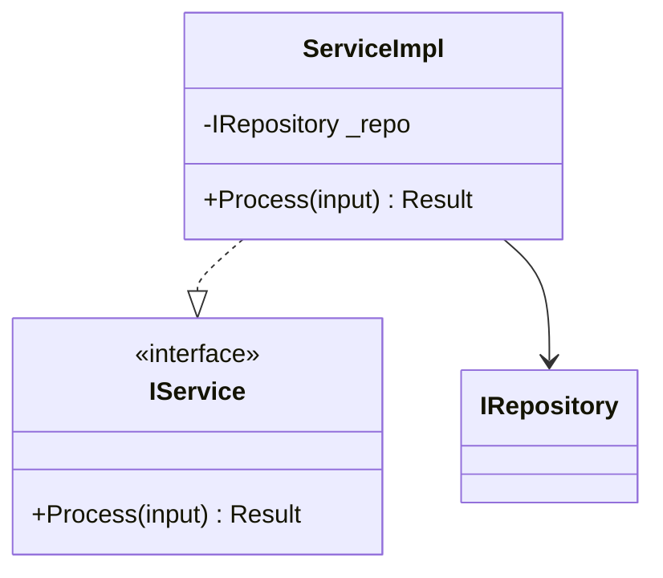
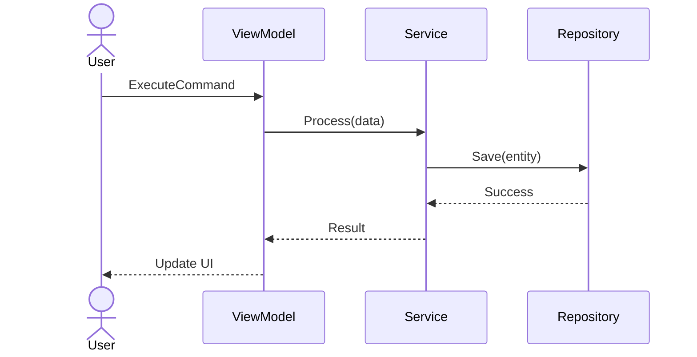
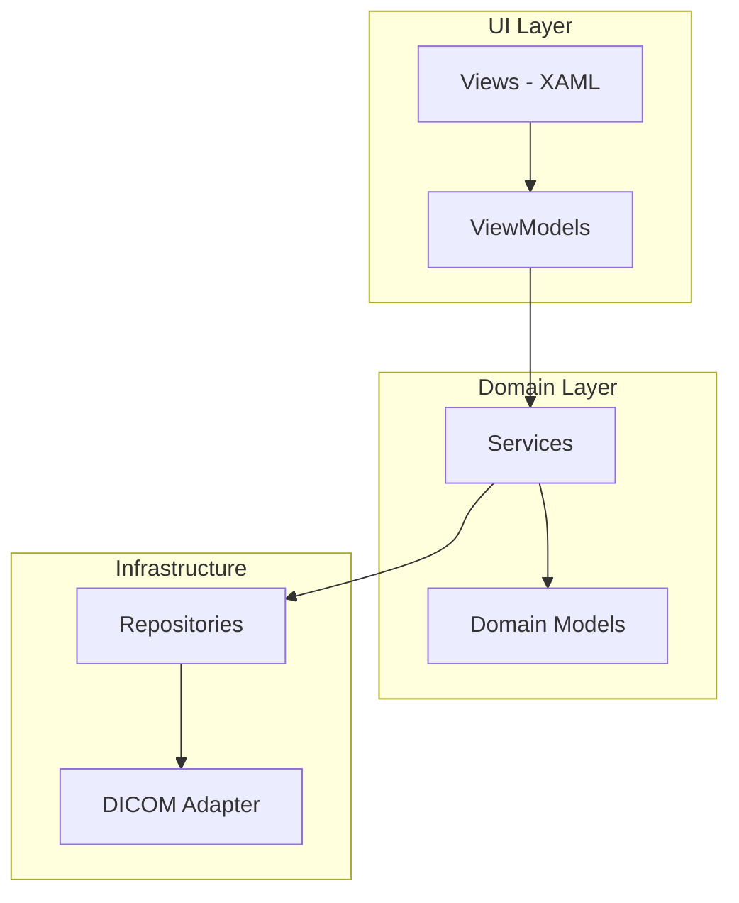
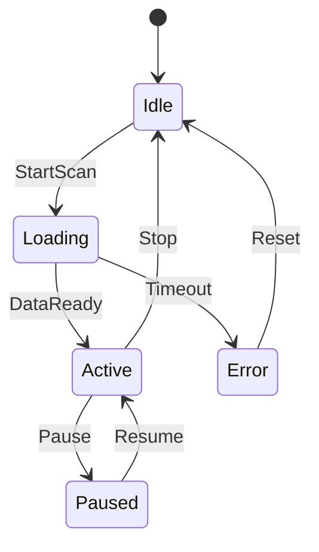

# Architecture Design

使用此 skill 处理 architecture-level design tasks：比较方案、生成 diagrams、编写 Architecture Decision Records、分析 dependencies、评估 cross-project impact。

## When to Use

- 开始新 module 时 — 生成包含 layering 和 interfaces 的 architecture proposal。
- 比较 design options 时 — 产出结构化 pros/cons analysis。
- 记录 decisions 时 — 生成 ADR（Architecture Decision Record）。
- 可视化 structure 时 — 生成 Mermaid class/sequence/component diagrams。
- 评估 change impact 时 — 跨 projects 分析 dependency chains。
- 审查 coupling 时 — 检测 circular dependencies 或 layer violations。

## Diagram Selection Decision Tree

不同 design questions 需要不同 diagrams。请**有意选择** — 不要每次都默认 class diagram。

| Design question | Use this diagram |
|-----------------|------------------|
| "What classes/interfaces exist and how do they relate?" | **Class diagram** |
| "How do components collaborate during a workflow?" | **Sequence diagram** (one per use case) |
| "What is the high-level system structure / layering?" | **Component diagram** |
| "What states does this object move between?" | **State diagram** |
| "What is the data flow through the pipeline?" | **Flowchart** (`graph LR`) |
| "What is the deployment topology?" | **Deployment diagram** (component diagram with subgraphs per host/process) |

**Per design proposal**：包含**一个 component diagram**（overview），再根据最有信息量的内容，至少包含 {class, sequence, state} 之一。不要四种都放 — 冗余 diagrams 会削弱信息。

## Domain-Anchored Examples

当 design 触及 CT/DICOM/Spectral/ISP 时，diagrams 和 proposals 应体现来自 `domain-knowledge` 的**真实 domain constraints**，而不是 generic ViewModel/Service shapes。示例：

- **SBI version compatibility** → 在 Reader 与 Data 之间展示 version-gate component（one-way compatibility rule）
- **Concurrent spectral results limit** → 在 spectral engine 前展示 throttler / semaphore（max-4 rule）
- **DICOM read/write boundary** → 将 DICOM adapter 展示为 dedicated layer；domain types 从不暴露 `DicomDataset`
- **Lossy compression guard** → 在 diagnostic-pipeline entry 展示 transfer-syntax check
- **MVVM for medical UI** → ViewModels 从不直接调用 DICOM I/O；通过 Service 路由
- **Cross-solution shared DLL** → 将 published artifact 展示为 external rectangle，而不是 project node

如果要求此 skill 为 domain concept 绘图，生成的 Mermaid 应让约束可见 — edge 上的 label、node 上的 `<<gateway>>` stereotype，或 comment。

## Preferred Inputs

提供以下一项或多项：

- **Design question** — 例如 "Should we use Strategy or State pattern for scan mode switching?"
- **Module / component name** — 用于 diagram generation 或 dependency analysis。
- **Change description** — 用于 cross-project impact assessment。
- **Existing code** — skill 会分析当前 structure。

## Output Types

### 1. Architecture Proposal

用结构化 analysis 比较 solution options：

```markdown
## Architecture Proposal — [Topic]

### Option A: [Name]
- **Approach:** [Description]
- **Pros:** [List]
- **Cons:** [List]
- **Fit for CT:** [IEC 62304 / DICOM / performance considerations]

### Option B: [Name]
- **Approach:** [Description]
- **Pros:** [List]
- **Cons:** [List]
- **Fit for CT:** [considerations]

### Recommendation
Option [X] because [rationale].

### Risk
[What could go wrong with this choice]
```

**Decision is made by the Architect / Tech Lead — AI provides analysis only.**

### 2. Architecture Decision Record (ADR)

```markdown
# ADR-[NNN]: [Decision Title]

- **Status:** Proposed | Accepted | Deprecated | Superseded
- **Date:** [YYYY-MM-DD]
- **Decision Makers:** [Architect, Tech Lead]

## Context
[Why this decision is needed — the problem or requirement]

## Decision
[What we decided to do]

## Rationale
[Why this option was chosen over alternatives]

## Alternatives Considered
1. [Alternative A] — rejected because [reason]
2. [Alternative B] — rejected because [reason]

## Consequences
- **Positive:** [benefits]
- **Negative:** [trade-offs]
- **Risks:** [what could go wrong]

## Compliance
- IEC 62304 class: [A/B/C]
- Impact on existing modules: [list]
- Migration plan: [if applicable]
```

### 3. Mermaid Diagrams

根据 analysis scope 生成 diagrams：

**Class Diagram** — 用于 module structure：


**Sequence Diagram** — 用于 workflow / interaction：


**Component Diagram** — 用于 system overview：


**State Diagram** — 用于 stateful components：


### 4. Dependency Analysis

分析 modules 之间的 coupling：

```markdown
## Dependency Analysis — [Module]

### Direct Dependencies (this module depends on)
| Dependency | Type | Coupling | Risk |
|-----------|------|----------|------|
| ModuleA   | NuGet | Loose   | Low  |
| ModuleB   | Project ref | Tight | Medium |

### Reverse Dependencies (modules that depend on this)
| Consumer | Via | Impact if Changed |
|----------|-----|-------------------|
| ProjectX | Interface | Low (abstracted) |
| ProjectY | Direct class ref | High (breaking) |

### Circular Dependencies
- ⚠ ModuleA → ModuleB → ModuleA (via EventBus)
- Suggestion: Extract shared interface to Common module

### Layer Violations
- ⚠ ViewModel directly references Repository (skip Service layer)
- Suggestion: Inject via IService interface
```

### 5. Cross-Project Impact Assessment

针对影响 shared components（PPTCommon、CT_SW_Common）的变更：

```markdown
## Cross-Project Impact — [Change Description]

### Changed Component
[Component name, API changes, behavioral changes]

### Affected Projects
| Project | Impact | Action Required | Owner |
|---------|--------|----------------|-------|
| MIA_Dev | API signature change | Update call sites | [Name] |
| MIC_Dev | No direct use | None | — |
| Astra   | New project, uses new API | Already compatible | [Name] |

### Migration Plan
1. [Step 1]
2. [Step 2]

### Approval Required
- [ ] Tech Lead
- [ ] Affected project Owners
- [ ] Safety Owner (if Class B/C)
```

## Architecture Principles (CT SW Department)

所有 architecture recommendations 都执行这些 principles：

1. **Clean Architecture** — Dependencies point inward. Domain has no external dependencies.
2. **MVVM for WPF** — View → ViewModel → Service → Repository. No code-behind logic.
3. **Dependency Injection** — Constructor injection via Autofac / built-in DI.
4. **Interface Segregation** — Small, focused interfaces. No "god interfaces".
5. **Single Responsibility** — Each class has one reason to change.
6. **No circular dependencies** — Use interfaces or events to break cycles.
7. **Shared components via NuGet** — PPTCommon, CT_SW_Common published as packages.
8. **DICOM isolation** — DICOM protocol details wrapped behind abstraction layer.
9. **Failure isolation must filter CLR-fatal exceptions** — 任何用于将 non-essential subsystem 与 host 隔离的 architectural `try/catch` boundary（startup loggers、telemetry emitters、optional diagnostics）都必须使用精确 filter：
   ```csharp
   catch (Exception ex) when (!(ex is OutOfMemoryException)
                            && !(ex is StackOverflowException)
                            && !(ex is ThreadAbortException))
   ```
   在 isolation boundary 使用裸 `catch (Exception)`（或没有 `when` 的 `catch` / `catch (Exception ex)`）属于 architecture violation，即使 prose 写了 "let CLR-fatal propagate" — prose 不可执行。任何提到 isolation 的 code sample、ADR 或 interface contract 中，architecture proposal 必须显式写出 filtered form。内部 fallback `catch` blocks（例如 warning-write 自身可能失败时）必须使用相同 filter。

详细规则见 [architecture-principles.md](./references/architecture-principles.md)。

## Quality Rules

1. **AI proposals are drafts** — Architect / Tech Lead 做最终决策。
2. **Diagrams must be verifiable** — Mermaid syntax 必须能正确渲染。
3. **ADRs must be versioned** — 提交到 repo 的 `docs/adr/` 下。
4. **Impact assessments must name owners** — 每个 affected project 都需要 responsible person。
5. **No gold-plating** — 推荐满足 requirements 的最简单方案。
6. **Pick diagrams deliberately** — 使用 [Diagram Selection Decision Tree](#diagram-selection-decision-tree)；不要默认包含全部四类 diagram。
7. **Anchor to domain when relevant** — 如果 design 触及 DICOM/Spectral/ISP，diagram 必须让 domain constraint 可见（见 [Domain-Anchored Examples](#domain-anchored-examples)）。

## Portability Note

此 skill 设计为 **team-portable**。proposal/ADR templates、4 种 Mermaid diagram patterns、8 条 CT architecture principles 和 cross-project impact format 都是通用的，适用于任何 layered .NET application。Team-specific principles（DI container choice、naming conventions、shared-package layout）应放在 `references/architecture-principles.md` 中，由各团队自定义。[Domain-Anchored Examples](#domain-anchored-examples) 中的 `domain-knowledge` cross-references 会自动解析到已安装的对应团队 domain skill。
