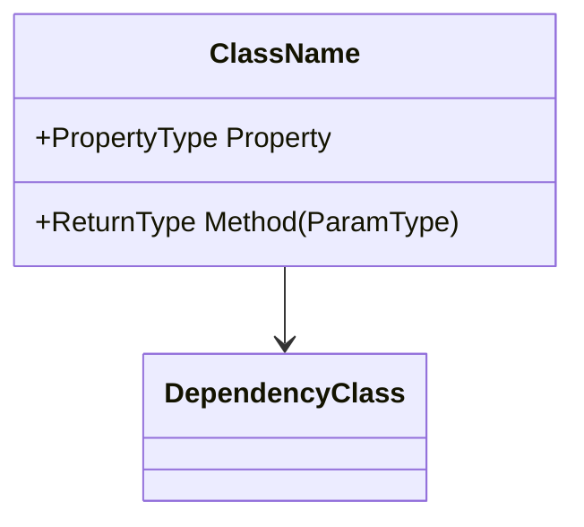
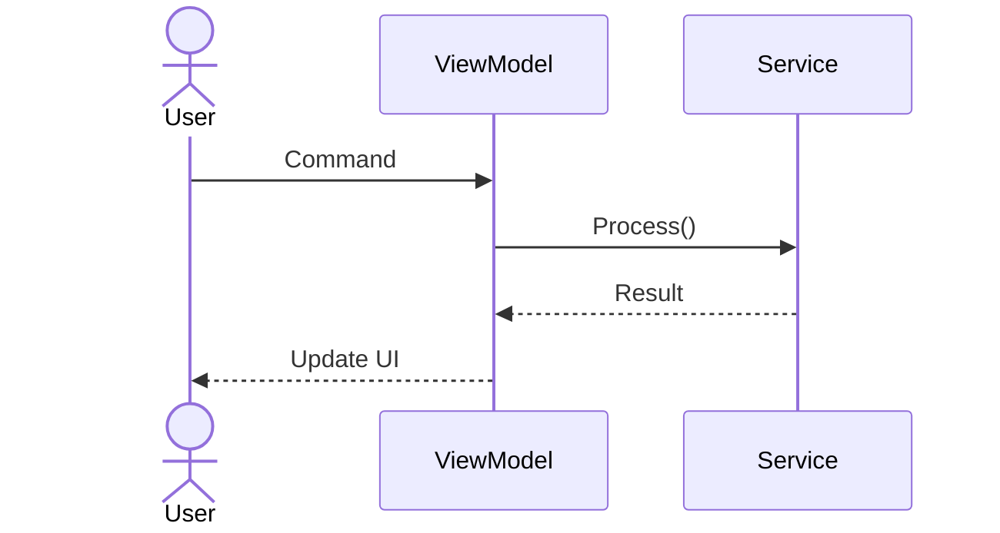
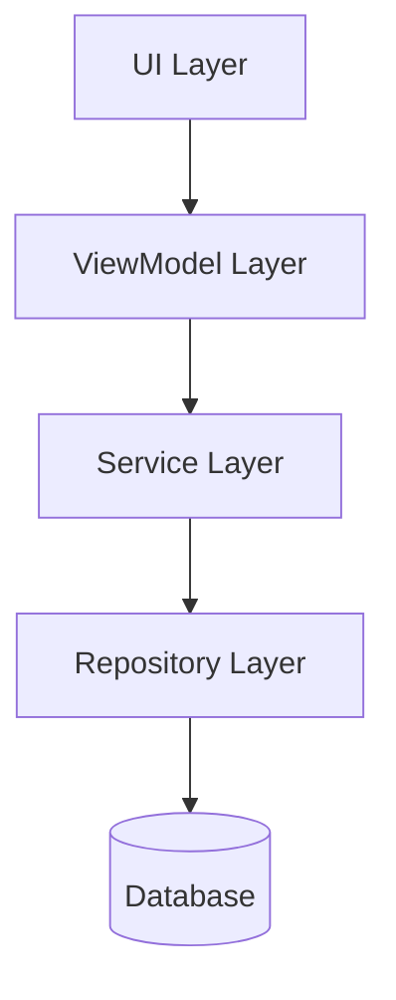

# Documentation Generator

使用此 skill 为 CT software department projects 生成结构化 documentation artifacts，并与 IEC 62304 和 ISO 13485 requirements 对齐。

## When to Use

- 实现 feature 后 — 生成 SDS sections、API docs。
- Architecture design 期间 — 生成 UML/Mermaid diagrams。
- Release 前 — 从 git history 生成 Release Notes。
- Change assessment 期间 — 生成 DFMEA draft 或 Impact Analysis。
- 用于 training / knowledge sharing — 生成 structured materials。

## Related Skill: domain-knowledge

所有 generated documents 都必须使用正确 CT terminology。写作前，查阅 `domain-knowledge`：

- **ct-glossary.md** — formal feature names（"Precise Image" not "AI Recon"）、正确 units 和 abbreviations
- **clinical-workflow.md** — standard scanner / ISP workflow vocabulary
- **dicom-patterns.md** — API docs 和 interface descriptions 中的正确 tag references
- **safety-rules.md** — SDS section 7（Safety Considerations）和 DFMEA/Impact-Analysis safety sections 的 standard safety-warning text
- **spectral-knowledge.md** — Spectral CT documentation 的 result type units、constraints 和 version gates

对于 Class B/C documents，还要引用 `dfmea-analysis` 和 `ifu-generator` skills，生成相应 draft sections。

## Preferred Inputs

提供：

- **Document type** — 以下之一：`SDS`、`API`、`architecture`、`release-notes`、`DFMEA`、`impact-analysis`、`training`。
- **Scope** — module name、class name、feature name，或 git range（用于 release notes）。
- **Safety class** — A/B/C（影响 documentation depth）。
- **Existing code / design** — 用作上下文。

## Document Types

### 1. Software Design Specification (SDS)

生成 IEC 62304 compliant design documentation：

```markdown
# SDS — [Module Name]

## 1. Purpose
[What this module does and why]

## 2. Scope
[What is included / excluded]

## 3. Architecture Overview
[Mermaid class diagram or component diagram]

## 4. Interface Description
[Public API, events, data contracts]

## 5. Data Design
[Data structures, state management, persistence]

## 6. Behavioral Design
[Sequence diagrams for key workflows]

## 7. Safety Considerations
[IEC 62304 class, risk mitigations, safety-critical paths]

## 8. Dependencies
[External libraries, other modules, hardware interfaces]

## 9. Traceability
[Requirement ID → Design element → Test case mapping]
```

### 2. API Documentation

生成 XML doc comments 和 Markdown API reference：

```csharp
/// <summary>
/// [Method purpose — one sentence]
/// </summary>
/// <param name="paramName">[Parameter description]</param>
/// <returns>[Return value description]</returns>
/// <exception cref="ArgumentNullException">
/// Thrown when <paramref name="paramName"/> is null.
/// </exception>
/// <example>
/// <code>
/// var result = instance.MethodName(input);
/// </code>
/// </example>
```

Markdown output：
```markdown
### `MethodName(Type paramName) → ReturnType`

**Purpose:** [description]

**Parameters:**
| Name | Type | Description | Required |
|------|------|-------------|----------|
| paramName | Type | description | Yes |

**Returns:** ReturnType — [description]

**Exceptions:**
- `ArgumentNullException` — when paramName is null.

**Example:**
[code example]
```

### 3. Architecture Diagrams (Mermaid)

按 requested type 生成 diagrams：

**Class Diagram:**


**Sequence Diagram:**


**Component Diagram:**


### 4. Release Notes

从 git history 生成：

```markdown
# Release Notes — v[X.Y.Z] — [Date]

## New Features
- **[Feature Name]**: [Description] ([Story ID])

## Bug Fixes
- **[Fix Title]**: [Root cause and fix description] ([Bug ID])

## Improvements
- **[Improvement]**: [Description]

## Breaking Changes
- **[Change]**: [Migration guide]

## Known Issues
- **[Issue]**: [Workaround if available]

## Test Summary
- Unit Tests: [X passed / Y total]
- BDD Scenarios: [X passed / Y total]
- TICS Level: [Level]
```

### 5. DFMEA Draft

生成 draft Design Failure Mode and Effects Analysis：

```markdown
## DFMEA — [Change Description]

| # | Failure Mode | Effect | S | Cause | O | Detection | D | RPN | Mitigation |
|---|-------------|--------|---|-------|---|-----------|---|-----|------------|
| 1 | [mode]      | [effect]| ? | [cause]| ? | [method]  | ? | ?   | [action]   |

⚠ S/O/D scores are AI suggestions only.
Final RPN must be confirmed by Safety Owner.
```

Severity (S)、Occurrence (O)、Detection (D)：1-10 scale。

### 6. Impact Analysis

生成 structured change impact assessment：

```markdown
## Impact Analysis — [Change Description]

### Direct Impact
- [Files/modules directly modified]

### Indirect Impact
- [Dependent modules affected via API/interface changes]

### Test Impact
- [Test cases that need re-execution]
- [New tests needed]

### Configuration Impact
- [Config files, environment variables, database changes]

### Deployment Impact
- [Deployment steps, rollback plan]

### Safety Impact (IEC 62304)
- Safety class: [A/B/C]
- Patient safety risk: [Yes/No — describe if Yes]
- Regulatory impact: [None / Notification / Submission]

### Approval Requirements
- [ ] Code Review: [Reviewer]
- [ ] Tech Lead: [Name]
- [ ] Safety Owner: [Name] (if Class B/C)
- [ ] DFMEA update: [Required / Not Required]
```

## Quality Rules

1. **AI documentation is DRAFT only** — every output must be reviewed by the designated confirmer.
2. **No fabricated content** — if information is unknown, mark it as `[TBD — confirm with stakeholder]`.
3. **Mermaid diagrams must be syntactically valid** — verify rendering before committing.
4. **Traceability** — every SDS section should reference the source requirement.
5. **Safety class determines depth** — Class C requires the most detailed documentation.

## Confirmer Matrix

| Document Type | Confirmer | Approval |
|--------------|-----------|----------|
| SDS | Architect + SE | Tech Lead sign-off |
| API Documentation | Developer | 同行评审 |
| Architecture Diagram | Architect | 技术负责人 |
| Release Notes | PM | PM sign-off |
| DFMEA | Safety Owner | Safety Owner sign-off |
| 影响分析 | 技术负责人 | Tech Lead + affected Owner |
| Training Material | Instructor | 同行评审 |

## Portability Note

此 skill 具备 **team-portable** 性。document type templates（SDS / API / architecture / release-notes / DFMEA / impact-analysis）、Mermaid patterns 和 confirmer matrix 遵循 IEC 62304 / ISO 13485，适用于任何 medical-device codebase。Terminology 和 safety-warning text 来自单独的 `domain-knowledge` skill — 其他团队的 domain skill 会自动提供不同内容。Team-specific document conventions（header logos、document-ID schemes、internal review roles）应放在 `references/` files 或 `/memories/repo/` 中，不要硬编码在这里。
