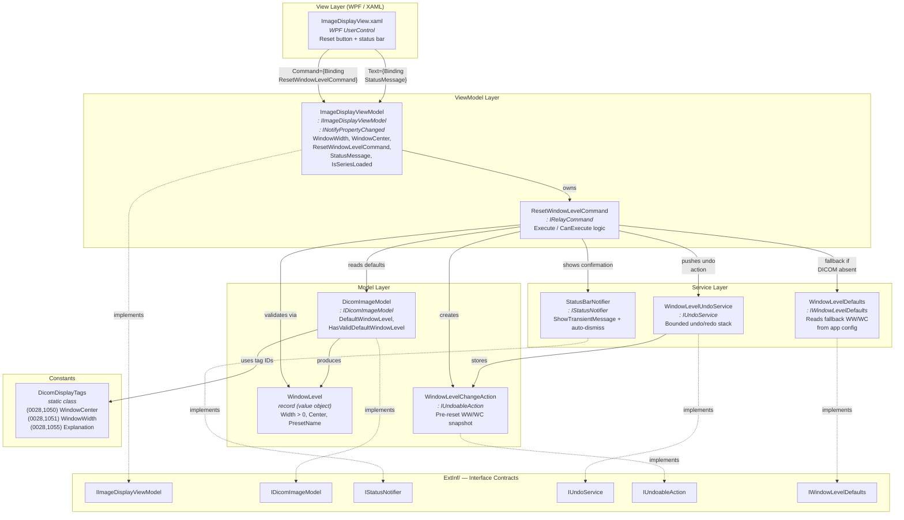

# WW/WC Reset — 组件图

## Level 2：容器 / 组件视图

## 分层依赖规则

1. **View → ViewModel** 仅通过 WPF data binding（无直接方法调用）。
2. **ViewModel → Model/Services** 通过构造函数注入的接口（`IDicomImageModel`、`IStatusNotifier`、`IUndoService`、`IWindowLevelDefaults`）。
3. **Model → Constants** — `DicomImageModel` 使用 `DicomDisplayTags` 作为 DICOM tag 标识符。
4. **无向上依赖** — Model 和 Services 从不引用 ViewModel 或 View。
5. **ExtInf/ contracts** 是编译边界 — `Src/` 依赖 `ExtInf/`，反向依赖禁止。

## 项目布局映射

| 层 | Project / Folder | Namespace |
|----|------------------|-----------|
| Contracts | `ExtInf/ImageDisplay/` | `Philips.CT.Host.ImageDisplay` |
| View | `Src/ImageDisplay/Views/` | `Philips.CT.Host.ImageDisplay.Views` |
| ViewModel | `Src/ImageDisplay/` | `Philips.CT.Host.ImageDisplay` |
| Commands | `Src/ImageDisplay/Commands/` | `Philips.CT.Host.ImageDisplay.Commands` |
| Models | `Src/ImageDisplay/Models/` | `Philips.CT.Host.ImageDisplay.Models` |
| Services | `Src/ImageDisplay/Services/` | `Philips.CT.Host.ImageDisplay.Services` |
| Constants | `Src/ImageDisplay/Constants/` | `Philips.CT.Host.ImageDisplay.Constants` |
| Resources | `Src/ImageDisplay/Resources/` | `Philips.CT.Host.ImageDisplay.Resources` |
| Unit Tests | `Src/ImageDisplay/Test/` | `Philips.CT.Host.ImageDisplay.Test` |
| Module Tests | `Src/ModuleTests/WwWcReset/` | `Philips.CT.Host.ImageDisplay.ModuleTests` |