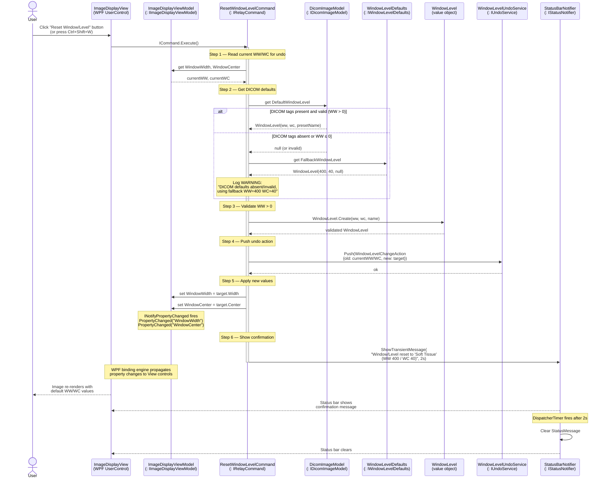
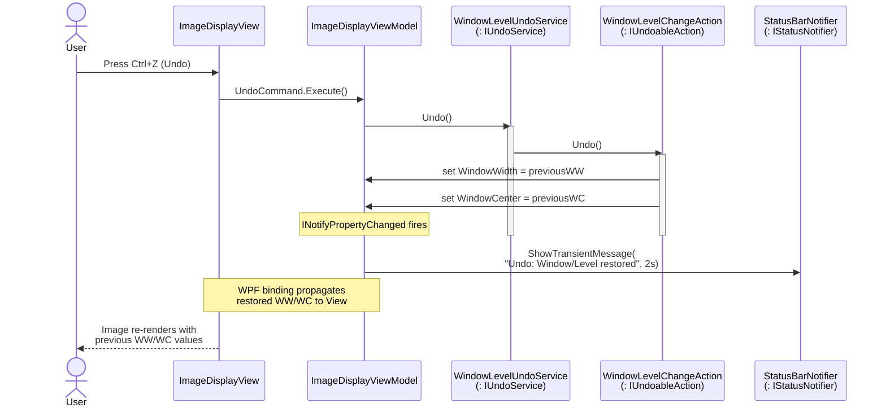
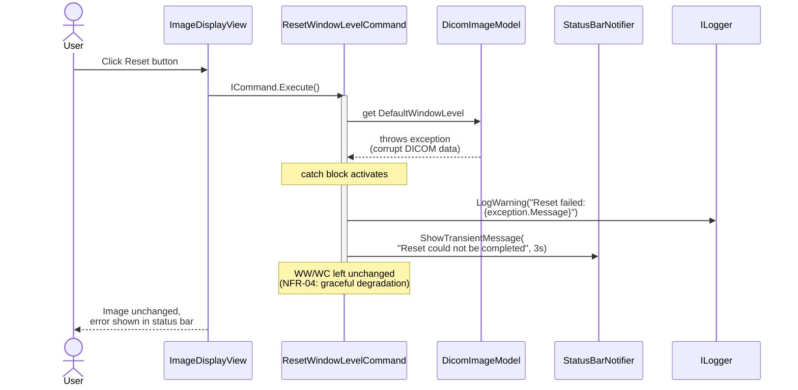

# WW/WC Reset — 时序图

## 主流程：用户点击 Reset 按钮

```mermaid
sequenceDiagram
    actor User
    participant View as ImageDisplayView<br/>(WPF UserControl)
    participant VM as ImageDisplayViewModel<br/>(: IImageDisplayViewModel)
    participant Cmd as ResetWindowLevelCommand<br/>(: IRelayCommand)
    participant Model as DicomImageModel<br/>(: IDicomImageModel)
    participant Fallback as WindowLevelDefaults<br/>(: IWindowLevelDefaults)
    participant WL as WindowLevel<br/>(value object)
    participant Undo as WindowLevelUndoService<br/>(: IUndoService)
    participant Notifier as StatusBarNotifier<br/>(: IStatusNotifier)

    User->>View: Click "Reset Window/Level" button<br/>(or press Ctrl+Shift+W)
    View->>Cmd: ICommand.Execute()
    activate Cmd

    Note over Cmd: Step 1 — Read current WW/WC for undo
    Cmd->>VM: get WindowWidth, WindowCenter
    VM-->>Cmd: currentWW, currentWC

    Note over Cmd: Step 2 — Get DICOM defaults
    Cmd->>Model: get DefaultWindowLevel
    alt DICOM tags present and valid (WW > 0)
        Model-->>Cmd: WindowLevel(ww, wc, presetName)
    else DICOM tags absent or WW ≤ 0
        Model-->>Cmd: null (or invalid)
        Cmd->>Fallback: get FallbackWindowLevel
        Fallback-->>Cmd: WindowLevel(400, 40, null)
        Note over Cmd: Log WARNING:<br/>"DICOM defaults absent/invalid,<br/>using fallback WW=400 WC=40"
    end

    Note over Cmd: Step 3 — Validate WW > 0
    Cmd->>WL: WindowLevel.Create(ww, wc, name)
    WL-->>Cmd: validated WindowLevel

    Note over Cmd: Step 4 — Push undo action
    Cmd->>Undo: Push(WindowLevelChangeAction<br/>{old: currentWW/WC, new: target})
    Undo-->>Cmd: ok

    Note over Cmd: Step 5 — Apply new values
    Cmd->>VM: set WindowWidth = target.Width
    Cmd->>VM: set WindowCenter = target.Center
    Note over VM: INotifyPropertyChanged fires<br/>PropertyChanged("WindowWidth")<br/>PropertyChanged("WindowCenter")

    Note over Cmd: Step 6 — Show confirmation
    Cmd->>Notifier: ShowTransientMessage(<br/>"Window/Level reset to 'Soft Tissue'<br/>(WW 400 / WC 40)", 2s)

    deactivate Cmd

    Note over VM,View: WPF binding engine propagates<br/>property changes to View controls

    View-->>User: Image re-renders with<br/>default WW/WC values
    Notifier-->>View: Status bar shows<br/>confirmation message

    Note over Notifier: DispatcherTimer fires after 2s
    Notifier->>Notifier: Clear StatusMessage
    Notifier-->>View: Status bar clears
```

## Undo 流程：用户按 Ctrl+Z

```mermaid
sequenceDiagram
    actor User
    participant View as ImageDisplayView
    participant VM as ImageDisplayViewModel
    participant Undo as WindowLevelUndoService<br/>(: IUndoService)
    participant Action as WindowLevelChangeAction<br/>(: IUndoableAction)
    participant Notifier as StatusBarNotifier<br/>(: IStatusNotifier)

    User->>View: Press Ctrl+Z (Undo)
    View->>VM: UndoCommand.Execute()
    VM->>Undo: Undo()
    activate Undo
    Undo->>Action: Undo()
    activate Action
    Action->>VM: set WindowWidth = previousWW
    Action->>VM: set WindowCenter = previousWC
    Note over VM: INotifyPropertyChanged fires
    deactivate Action
    deactivate Undo

    VM->>Notifier: ShowTransientMessage(<br/>"Undo: Window/Level restored", 2s)

    Note over VM,View: WPF binding propagates<br/>restored WW/WC to View

    View-->>User: Image re-renders with<br/>previous WW/WC values
```

## 错误流程：Reset 期间发生异常

```mermaid
sequenceDiagram
    actor User
    participant View as ImageDisplayView
    participant Cmd as ResetWindowLevelCommand
    participant Model as DicomImageModel
    participant Notifier as StatusBarNotifier
    participant Log as ILogger

    User->>View: Click Reset button
    View->>Cmd: ICommand.Execute()
    activate Cmd

    Cmd->>Model: get DefaultWindowLevel
    Model-->>Cmd: throws exception<br/>(corrupt DICOM data)

    Note over Cmd: catch block activates
    Cmd->>Log: LogWarning("Reset failed:<br/>{exception.Message}")
    Cmd->>Notifier: ShowTransientMessage(<br/>"Reset could not be completed", 3s)
    Note over Cmd: WW/WC left unchanged<br/>(NFR-04: graceful degradation)

    deactivate Cmd
    View-->>User: Image unchanged,<br/>error shown in status bar
```