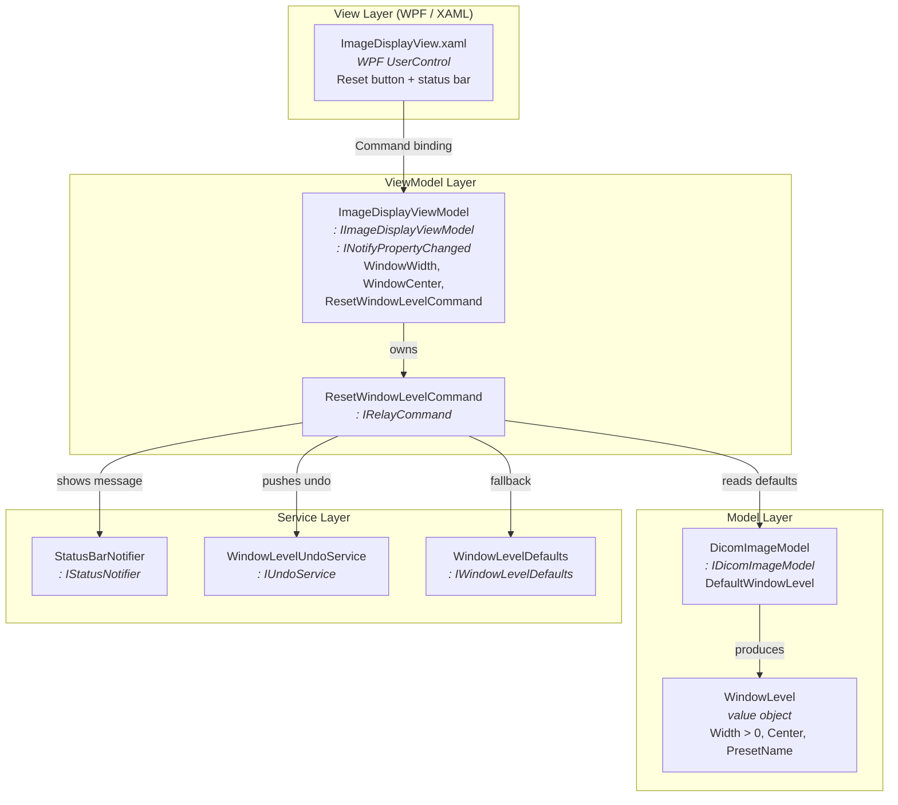
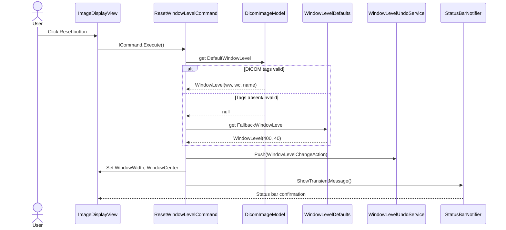

# Sub-System Design Specification

## PURPOSE

<!-- GUIDANCE: 本文档旨在为产品 <Product Name> 提供 <System or Sub-System Design Specification>。 -->

本文档旨在为 Philips CT/AMI 产品的 **Image Display** sub-system 提供 Sub-System Design Specification（SSDS）。该 sub-system 负责在诊断视口中渲染 CT 图像切片，并向临床操作者提供显示参数控件（Window Width / Window Center 调整、zoom、pan 和 reset-to-default）。

## SCOPE

<!-- GUIDANCE: 本记录适用于 Philips CT/AMI。 -->
<!-- GUIDANCE: [提供设计文档范围描述，以说明本文档所描述设计的边界] -->

本记录适用于 Philips CT/AMI Image Display sub-system。本设计文档范围覆盖：

- WW/WC Reset to Default 功能（按 SwRS 的 FR-01 到 FR-07、NFR-01 到 NFR-05）
- Image Display module 的 MVVM 分层架构
- `ExtInf/ImageDisplay/` 中定义的 interface contracts
- `Src/ImageDisplay/` 中的 implementation components
- 用于显示参数变化的 undo infrastructure
- 用于 windowing attributes 的 DICOM tag access abstraction

范围外：DICOM dataset loading/parsing infrastructure、image rendering engine internals、multi-viewport synchronisation 和 non-CT modality support。

## ARCHITECTURE DESIGN OBJECTIVES

<!-- GUIDANCE: [Author: Lead Designer or Design Authority] -->
<!-- GUIDANCE: [为保持整个系统一致，最好由 Lead Designer 编写本节。但考虑时间约束和工作分配，Design Authority 可在 Overview 小节后完成部分或全部小节。在这种情况下，Lead Designer 应作为 reviewer 之一。] -->

### Overview

<!-- GUIDANCE: [此处呈现系统或 Sub-System 的简短历史、背景和用途。包括 system 或 Sub-System 如何适配产品的描述，并在适用时引用 parent PRS 或 SDS。] -->

Image Display sub-system 是查看 CT 图像切片的主要临床界面。它在 viewport 中渲染 DICOM image data，并提供交互控件来调整显示参数 — 最关键的是 Window Width（WW）和 Window Center（WC），它们控制 CT Hounsfield Unit 值到显示灰阶范围的映射。

WW/WC Reset to Default 功能新增一键机制，用于恢复 DICOM tags (0028,1050) Window Center 和 (0028,1051) Window Width 中按 DICOM PS3.3 §C.7.6.3.1.5 存储的扫描仪或 protocol 默认 windowing values。该功能分类为 IEC 62304 Class B，因为不正确的 WW/WC 值可能遮蔽临床显著特征（例如肺结节、出血），导致漏诊或延迟诊断。

该 sub-system 遵循 WPF Model–View–ViewModel（MVVM）模式，并严格分离关注点：Views 是纯 XAML（零 code-behind），ViewModels 暴露 commands 和 observable properties，Models 封装 DICOM data access。

### Assumptions and Constraints

<!-- GUIDANCE: [列出创建本文档时使用的任何 assumptions constraints。可包括跨产品线影响、被要求“re-used”而不是重新开发的 existing components 等。] -->
**Assumptions：**

1. 应用是以 .NET（version TBD）为目标、采用 MVVM 架构的 WPF desktop client。
2. 不存在既有 `Src/` tree 或 undo infrastructure — 这是 greenfield implementation（ADR-001）。
3. 当 reset action 被调用时，DICOM dataset 已加载并可由 model layer 访问；此功能不处理 dataset loading。
4. 部署目标是 secondary review workstation（IEC 62304 Class B）。如果确认部署在 primary diagnostic workstation（OQ-01），将需要 Class C lifecycle activities，但架构不变。

**Constraints：**

1. WPF/MVVM architecture — Views 中零 code-behind；所有逻辑通过 ViewModel command bindings。
2. Namespace：`Philips.CT.Host.ImageDisplay.*` — 不使用 VS default namespace。
3. 所有 UI strings 来自 `.resx` resource files — 无硬编码 strings。
4. WW > 0 invariant 在 value-object 层强制 — 系统绝不允许 WW ≤ 0 到达 display pipeline。
5. DICOM tag access 通过集中 constants class，并用 XML doc comments 引用 DICOM PS3.3 §C.7.6.3.1.5。
6. Zero build warnings；warnings treated as errors。
7. 所有 ViewModel dependencies 通过 constructor injection — 不使用 service locator pattern。
## SYSTEM ARCHITECTURE

### Design Overview

<!-- GUIDANCE: [本节描述系统顶层设计，包括 operation theory 和 system decomposition。呈现各 sub-systems 及其关系。交互和行为稍后处理。可按需添加其他小标题。] -->
<!-- GUIDANCE: 设计概览描述整体图景，以帮助理解后续细节。这里使用 diagram\s 来解释整体 system design 和 sub-systems 之间关系。如果项目团队判断是否需要 Sub-System Design Specification 文档来恰当地记录 system architecture，应在本节说明该决定并给出 rationale。] -->

Image Display sub-system 按 MVVM pattern 分解为四层，并增加一个 Service layer 来承载横切关注点：

1. **View Layer** — WPF UserControls（XAML），渲染 image viewport、display-parameter controls 和 status bar。零 code-behind；所有交互通过 data binding。
2. **ViewModel Layer** — 暴露 observable properties（`WindowWidth`、`WindowCenter`、`IsSeriesLoaded`、`StatusMessage`）和 commands（`ResetWindowLevelCommand`、`UndoCommand`）。在 View 与 Model/Service layers 之间中介。
3. **Model Layer** — 封装 DICOM image data。`DicomImageModel` 从 loaded series 解析 windowing attributes，并暴露验证过的 `WindowLevel` value objects。
4. **Service Layer** — 提供横切能力：status notification（`IStatusNotifier`）、undo management（`IUndoService`）和 fallback configuration（`IWindowLevelDefaults`）。

所有层的 interface contracts 均定义在 `ExtInf/ImageDisplay/`，确保实现可被替换以便测试（NSubstitute mocks），并确保跨仓库依赖只引用 interface package。

鉴于 Image Display module 范围有界，该分解记录在单一 SSDS 中；无需单独的 sub-system design documents。

### Primary Design Considerations

<!-- GUIDANCE: [解释与设计相关、需要理解的通用问题。可包括 manufacturing design considerations、service design considerations、cost、reliability、usability 等。] -->
<!-- GUIDANCE: [如适用，若首次在本 System 或 Sub-System design 中实现新技术：引用相应 Proof of Concept Report(s)，证明组织具备要采用技术的能力。可在后续“issue”标题下讨论。] -->
<!-- GUIDANCE: [按需在下方添加其他 issues。] -->

#### 患者安全 — WW > 0 不变量

Window Width（WW）为零或负数在 DICOM 标准中未定义，会产生黑图或反相图像，从而遮蔽全部诊断内容。设计通过 `WindowLevel` value object 在结构上强制 WW > 0，在构造时拒绝无效值。该守卫统一应用于来自 DICOM tags、fallback configuration 和 undo stack 的值。

#### 可用性 — 低于 200 ms 的响应时间

临床工作流对时间敏感。reset 动作必须在最低规格硬件上于 200 ms 内完成（button activation → viewport repaint → confirmation message）（NFR-01）。设计通过从 in-memory model 读取预解析 DICOM attributes（reset path 上无 file I/O），并仅更新触发 WPF binding refresh 的两个 ViewModel properties 来实现这一点。

#### 可靠性 — 优雅降级

设计必须在所有 DICOM dataset 变体下不崩溃（NFR-04）：missing tags、corrupt values、multi-frame series 和 empty series。reset command 用 try/catch 包裹其逻辑，记录 warnings，保持当前 WW/WC 不变，并通过 status bar 通知用户。

#### DICOM 标准可追溯性

所有 DICOM tag access 都集中在 `DicomDisplayTags` static class 中，并用 XML doc comments 引用 DICOM PS3.3 §C.7.6.3.1.5。除该类外不出现 magic-number tag literals（NFR-05）。

### Design Features

<!-- GUIDANCE: [Description:] -->
<!-- GUIDANCE: [描述动态模型、工作流，或 Sub-Systems / components 如何协同达成所需 features。可按需使用自然语言、图形模型和 use cases。Design features 通常聚焦 Clinical use，但新产品也可能包括其他新设计特性，例如 License Keys、Remote Service 等。] -->

#### WW/WC Reset to Default

WW/WC Reset 功能通过单次用户动作恢复活动视口的 DICOM 默认 Window Width 和 Window Center 值。工作流如下：

1. **User activates reset** — 点击 "Reset Window/Level" 按钮或按 Ctrl+Shift+W。
2. **View fires bound command** — WPF 通过 `ICommand` binding 调用 `ResetWindowLevelCommand.Execute()`。
3. **Command captures undo state** — 当前 `WindowWidth` 和 `WindowCenter` 被快照到 `WindowLevelChangeAction`。
4. **Command retrieves defaults** — 读取 `IDicomImageModel.DefaultWindowLevel`（DICOM tags 0028,1050/1051，多值的第一个值 index 0）。若缺失或无效（WW ≤ 0），回退到 `IWindowLevelDefaults.FallbackWindowLevel`（可配置，默认 WW=400，WC=40）。
5. **Command validates** — 通过 `WindowLevel.Create()` 创建 `WindowLevel` value object，强制 WW > 0。
6. **Command applies values** — 设置 `ImageDisplayViewModel.WindowWidth` 和 `.WindowCenter`。`INotifyPropertyChanged` 触发，WPF binding 传播到 View，图像重新渲染。
7. **Command pushes undo** — `WindowLevelChangeAction` 被推入 `IUndoService` stack。
8. **Command shows confirmation** — 使用格式化消息调用 `IStatusNotifier.ShowTransientMessage()`，当有 preset name（来自 tag 0028,1055）时包含它。消息在 ≥ 2 秒后自动消失。

以下 sequence diagram 展示该流程：

**选定设计模式（ADR-001）：**

- **RelayCommand**（`IRelayCommand`）用于 MVVM command binding — 轻量，无 framework dependency。
- **Value Object**（`WindowLevel`）用于 WW/WC pair — 在构造时强制 WW > 0 invariant。
- **Command pattern**（`IUndoableAction`）用于 undo/redo — 每个可撤销操作封装为 action object。
- **Strategy pattern** 用于 status notification — `IStatusNotifier` 抽象 feedback mechanism，使 ViewModel 与 UI framework 无关。

### Hardware Design

*Not Applicable — Image Display sub-system 是纯软件组件，没有硬件元素。它在由操作系统和 graphics driver 管理的标准显示硬件上渲染图像。*

### Software Design

Image Display sub-system 遵循分层 MVVM 架构，并使用构造函数注入依赖。所有 interface contracts 位于 `ExtInf/ImageDisplay/`（namespace `Philips.CT.Host.ImageDisplay`）；所有 implementations 位于 `Src/ImageDisplay/`，并为 Commands、Models、Services、Constants、Views 和 Resources 使用子命名空间。

#### Image Display ViewModel Module

`ImageDisplayViewModel`（实现 `IImageDisplayViewModel` 和 `INotifyPropertyChanged`）是中心协调者。它暴露：

- **Properties：** `WindowWidth`（double）、`WindowCenter`（double）、`IsSeriesLoaded`（bool）、`StatusMessage`（string）— 全部通过 `PropertyChanged` 可观察。
- **Commands：** `ResetWindowLevelCommand`（`IRelayCommand`）、`UndoCommand`（`IRelayCommand`）。
- **Constructor dependencies：** `IDicomImageModel`、`IStatusNotifier`、`IUndoService`、`IWindowLevelDefaults`。

ViewModel 从不直接访问 DICOM tags — 它委托 model 获取 default values，并委托 services 处理 fallback、undo 和 notification。

#### Reset Command Module

`ResetWindowLevelCommand`（实现 `IRelayCommand`）封装 reset 逻辑：

- `CanExecute` 仅在 `IsSeriesLoaded` 为 `true` 时返回 `true`。
- `Execute` 从 model 读取 defaults（多值 DICOM tags 的 index 0），验证 WW > 0，必要时应用 fallback，捕获 undo state，更新 ViewModel properties，并触发 status notification。
- 捕获所有异常，以 WARNING level 记录，并通过 `IStatusNotifier` 向用户呈现。出错时当前 WW/WC 保持不变。

#### DICOM Image Model Module

`DicomImageModel`（实现 `IDicomImageModel`）从 loaded series dataset 解析 DICOM windowing attributes：

- **Inputs：** DICOM tags (0028,1050) Window Center、(0028,1051) Window Width、(0028,1055) Window Center & Width Explanation — 通过 `DicomDisplayTags` constants 访问。
- **Outputs：** `DefaultWindowLevel`（nullable `WindowLevel` value object），包含第一个 preset（index 0）和可选 preset name。
- **Limits/defaults：** 如果 tags 缺失，`DefaultWindowLevel` 为 `null`。如果 WW ≤ 0，`HasValidDefaultWindowLevel` 为 `false`。

#### WindowLevel Value Object

`WindowLevel` 是在 `ExtInf/` 和 `Src/` 间共享的 record/struct。它强制领域不变量：

- `Width` 必须 > 0（由 `WindowLevel.Create()` factory method 强制；违规时抛出 `ArgumentOutOfRangeException`）。
- `Center` 是任意 finite double。
- `PresetName` 是可选项（来自 tag 0028,1055 的 nullable string）。

#### Undo Module

`WindowLevelUndoService`（实现 `IUndoService`）维护一个有界 stack（默认深度：20 entries，可配置）的 `IUndoableAction` objects。`WindowLevelChangeAction` 捕获 reset 前后的 WW/WC 值；`Undo()` 通过设置 ViewModel properties 恢复 reset 前值。

#### Fallback Configuration Module

`WindowLevelDefaults`（实现 `IWindowLevelDefaults`）从应用设置读取 fallback WW/WC 对（默认：WW = 400，WC = 40）。值在加载时验证（WW > 0）。配置可在不 rebuild 软件的情况下修改（FR-04）。

#### Status Notification Module

`StatusBarNotifier`（实现 `IStatusNotifier`）在 ViewModel 上设置绑定的 `StatusMessage` 属性，并启动 `DispatcherTimer` 以自动消失（按 FR-05 最短时长：2 秒）。当可用时，消息包含 preset name（例如 "Window/Level reset to 'Soft Tissue' (WW 400 / WC 40)"）。

#### DICOM Constants Module

`DicomDisplayTags` 是集中 DICOM tag identifiers 的 static class：

| Constant | 标签 | DICOM Reference |
|----------|-----|----------------|
| `WindowCenter` | (0028,1050) | PS3.3 §C.7.6.3.1.5 |
| `WindowWidth` | (0028,1051) | PS3.3 §C.7.6.3.1.5 |
| `WindowCenterWidthExplanation` | (0028,1055) | PS3.3 §C.7.6.3.1.5 |

每个 constant 都带有引用标准章节的 XML doc comment（NFR-05）。

#### System and Sub-System Software Risk Classification

<!-- GUIDANCE: [SW Classification 在 System level 展示，并通过 Sub-systems 的抽象分类图显示从 System 到 Sub-system 的分类层级] -->
<!-- GUIDANCE: [Software shall 按 Risk Management SOP (2003000438) 分类。SW Classification 应在 System Level (SDS) 和/或 Sub-System Level (SSDS and SwDS) 讨论，具体取决于复杂度和分解方法。Software Classification 应显示在 product Risk Management Matrix 中与 Software Module 相关的行。软件 module 分类将作为设计过程的一部分使用。] -->
<!-- GUIDANCE: Software Module Classification Table: -->
<!-- GUIDANCE: * 此 Software Module table 用于描述 system design。该表不执行 software classification；它只使用这些信息进一步描述设计决策。 -->

| 软件模块 | Software Module Description | Safety Classification (B or C only) |
| --- | --- | --- |
| ImageDisplayViewModel | 协调 display-parameter commands、WW/WC state 和 user notifications 的中心 ViewModel。属于 diagnostic image display pipeline。 | B |
| ResetWindowLevelCommand | 恢复 DICOM-default WW/WC values 的 command。直接影响 diagnostic image rendering。 | B |
| DicomImageModel | 从 loaded series 解析并暴露 DICOM windowing attributes 的 model。向 display pipeline 提供值。 | B |
| WindowLevel | 强制 WW > 0 invariant 的 value object。防止黑图/反相图像的 safety guard。 | B |
| WindowLevelUndoService | 用于 display-parameter changes 的 undo/redo stack。恢复先前 WW/WC values。 | B |
| WindowLevelDefaults | 当 DICOM defaults 缺失时提供 fallback WW/WC 的 configuration service。 | B |
| StatusBarNotifier | 非阻塞 UI notification service。不影响 image rendering。 | B |
| DicomDisplayTags | DICOM tag identifiers 的 static constants。无 runtime behaviour。 | B |

#### Sub-System Software Risk Classification Segregation Rationale

<!-- GUIDANCE: [此处为 A 和 B 的 SW Items 提供 SW segregation rationale] -->

Image Display sub-system 中所有 modules 都分类为 **Class B**。该 sub-system 通过定义良好的 interface boundaries 与 acquisition 和 reconstruction pipelines（它们具有独立 safety classifications）隔离：Image Display sub-system 以只读输入接收 DICOM data，且不修改、存储或传输 patient data。`WindowLevel` value object 通过结构性防止 WW ≤ 0 值进入 display pipeline，提供额外安全屏障，无论数据来源是 DICOM tags、fallback configuration 还是 undo stack。

如果 OQ-01 被解析为 primary diagnostic workstation deployment，分类可能提升到 Class C，这将需要额外 FMEA 和 formal verification activities，但不会改变 architecture decomposition。
<!-- GUIDANCE: [以下为示例，直到本节末尾] -->
<!-- GUIDANCE: <software ARCHITECTURE 应促进对 safe operation 所需 software items 的 segregation，并描述用于确保这些 SOFTWARE ITEMS 有效隔离的方法。Segregation 不限于 physical（processor 或 memory partition） -->
<!-- GUIDANCE: separation，也包括任何防止一个 SOFTWARE ITEM 对另一个产生负面影响的机制。隔离充分性基于所涉 RISKS 判断 -->
<!-- GUIDANCE: 且 rationale 必须文档化。 -->
<!-- GUIDANCE: 下图展示 SOFTWARE SYSTEM 内 SOFTWARE ITEMS 的可能 partitioning -->
<!-- GUIDANCE: 以及软件 safety classes 如何应用于分解中的 SOFTWARE ITEMS 组。 -->
<!-- GUIDANCE: Figure – Example of partitioning of SOFTWARE ITEMS -->
<!-- GUIDANCE: 在此示例中，MANUFACTURER 根据所开发 MEDICAL DEVICE SOFTWARE 的类型，知道 SOFTWARE SYSTEM 的初步 software safety classification 为 software safety class C。在 software ARCHITECTURE design 期间，MANUFACTURER 决定按图所示将 SYSTEM 分区为 3 个 SOFTWARE ITEMS – X、W 和 Z。MANUFACTURER 能够将所有可能导致死亡或 SERIOUS INJURY 的 HAZARDS 和 HAZARDOUS SITUATIONS 的 SOFTWARE SYSTEM contributions 隔离到 SOFTWARE ITEM Z，并将所有可能导致 non-SERIOUS INJURY 的剩余 SOFTWARE SYSTEM contributions 隔离到 SOFTWARE ITEM W。SOFTWARE ITEM W 分类为 software safety class B，SOFTWARE ITEM Z 分类为 software safety class C。因此 SOFTWARE ITEM Y 必须分类为 Class C。按该要求，SOFTWARE SYSTEM 也为 software safety class C。SOFTWARE ITEM X 已分类为 software safety class A。MANUFACTURER 能够记录 SOFTWARE ITEMS X 和 Y 之间以及 SOFTWARE ITEMS W 和 Z 之间隔离的 rationale，以保证隔离完整性。如果 SOFTWARE ITEMS X 和 Y 之间无法进行 partitioning segregation，则 SOFTWARE ITEM X 必须分类为 software safety class C。> -->

### Mechanical Design

*Not Applicable — Image Display sub-system 是纯软件组件，没有机械元素。*

### Interfaces

<!-- GUIDANCE: [Sub-Systems (SSDS): 识别 modules 彼此之间以及与外部实体交互的方式。] -->

Image Display sub-system 在 `ExtInf/ImageDisplay/` 中定义以下 interface contracts：

| 接口 | 用途 | 关键成员 |
|-----------|---------|-------------|
| `IImageDisplayViewModel` | 暴露给 View layer 的 ViewModel contract | `WindowWidth`, `WindowCenter`, `IsSeriesLoaded`, `ResetWindowLevelCommand` |
| `IDicomImageModel` | DICOM windowing data 的 model contract | `DefaultWindowLevel`, `HasValidDefaultWindowLevel` |
| `IStatusNotifier` | 瞬态非阻塞消息交付 | `ShowTransientMessage(string, TimeSpan)` |
| `IUndoService` | Undo/redo stack 管理 | `Push(IUndoableAction)`, `Undo()`, `Redo()`, `CanUndo`, `CanRedo` |
| `IUndoableAction` | 单个可撤销操作 | `Execute()`, `Undo()`, `Description` |
| `IWindowLevelDefaults` | Fallback WW/WC configuration | `FallbackWindowLevel` |

**External interfaces：**

- **DICOM dataset** — `DicomImageModel` 从 loaded DICOM series 读取 windowing attributes。dataset 由应用的 DICOM loading infrastructure 提供（超出本 sub-system 范围）。model 对 dataset 只读。
- **Application settings** — `WindowLevelDefaults` 从应用配置文件（例如 `appsettings.json`）读取 fallback WW/WC 值。这是初始化时的一次单向读取。
- **WPF binding engine** — View layer 通过标准 WPF data-binding infrastructure 绑定到 ViewModel properties 和 commands。不需要自定义 binding extensions。

### Database and Persistent Data Elements

*Not Applicable — Image Display sub-system 不使用数据库或持久数据存储。WW/WC display state 是瞬态的（in-memory ViewModel properties）。Fallback WW/WC 值从应用配置文件读取，该文件由应用 infrastructure 管理，而不是由本 sub-system 管理。*

### Error Handling and Reporting

Image Display sub-system 遵循与 NFR-04（无未处理异常）一致的防御性 error-handling strategy：

1. **Command-level catch：** `ResetWindowLevelCommand.Execute()` 用 try/catch 包裹其主体。任何异常都会：
   - 以 **WARNING** level 记录异常消息（按 NFR-03，无 PHI）。
   - 通过 `IStatusNotifier.ShowTransientMessage()` 向用户报告通用错误消息（"Reset could not be completed"）。
   - 当前 WW/WC 值保持不变 — display 永远不会处于不确定状态。

2. **Value-object validation：** 如果 WW ≤ 0，`WindowLevel.Create()` 抛出 `ArgumentOutOfRangeException`。这会被 command-level catch 捕获，并触发 fallback path（FR-07）。

3. **Fallback activation：** 当 DICOM tags 缺失或无效时，系统记录 WARNING 并应用可配置 fallback WW/WC（FR-04）。确认消息会说明已使用 fallback。

4. **Configuration validation：** `WindowLevelDefaults` 在加载时验证 fallback WW > 0。如果配置无效，service 记录 ERROR，并使用硬编码安全默认值（WW=400，WC=40）作为最后防线。

### Third Party Solutions

<!-- GUIDANCE: [识别任何 third party solutions 以及集成这些 solutions 所需的设计。] -->

Image Display sub-system 使用以下 third-party components：

| 组件 | 用途 | 集成 |
|-----------|---------|-------------|
| CommunityToolkit.Mvvm（或等价实现） | 提供 `RelayCommand` / `IRelayCommand` 实现 | NuGet package；用于 ViewModel 中的 MVVM command binding。如果项目更偏好自包含实现，也可编写 minimal `RelayCommand`。 |
| .NET WPF (`PresentationFramework`) | 用于 Views、data binding、`DispatcherTimer` 的 UI framework | .NET runtime 的一部分；无需额外集成。 |

### Legacy Elements

*Not Applicable — 这是 greenfield implementation。未纳入 legacy elements。*

## FUNCTIONAL AND PERFORMANCE SPECIFICATION

以下 functional and performance specifications 源自设计：

| 规格 | 值 | 来源 |
|---------------|-------|--------|
| Reset action end-to-end latency | ≤ 200 ms (95th percentile) | NFR-01 |
| WW valid range | > 0 (no upper bound) | FR-07, DICOM PS3.3 |
| WC valid range | any finite double | DICOM PS3.3 |
| Fallback WW default | 400 (configurable) | FR-04 |
| Fallback WC default | 40 (configurable) | FR-04 |
| Confirmation message display duration | ≥ 2 seconds, auto-dismiss | FR-05 |
| Undo stack depth | 20 entries (configurable) | ADR-001 |
| Multi-valued DICOM preset selection | Index 0 (first preset) | FR-03 |
| Keyboard shortcut | Ctrl+Shift+W (subject to OQ-05) | NFR-02 |

## SAFETY AND REGULATORY

Image Display sub-system 分类为 **IEC 62304 Class B**（见上方 Software Risk Classification 表）。设计处理以下安全考虑：

1. **WW > 0 invariant（R-02 mitigation）：** `WindowLevel` value object 在构造时强制 WW > 0，防止黑图或反相图像到达 display pipeline。这是主要 safety guard。
2. **Fallback on absent DICOM tags（R-01 mitigation）：** 当 DICOM windowing attributes 缺失时，应用可配置 fallback WW/WC values，确保图像始终以临床合理设置显示。
3. **No unhandled exceptions（NFR-04）：** reset command 捕获所有异常、记录并将 display 保留在先前状态。应用不会因 reset action 崩溃。
4. **No PHI in logs（NFR-03）：** reset action 只访问 display-parameter tags（WW/WC），不访问 patient-identifying information。Logging 限制为 tag values 和 error messages。
5. **Traceability（NFR-05）：** 所有 DICOM tag access 都集中化并带标准引用，便于审计。

如果部署目标确认为 primary diagnostic workstation（OQ-01），分类将提升为 Class C，需要 FMEA 和 formal verification activities。架构支持这种提升，无需结构性改变。

## FIELD DEPLOYMENT

### Supported Configurations

<!-- GUIDANCE: [就产品 field deployment 而言，定义 supported configurations，包括 peripherals、与其他 systems 的交互、network topologies 等。 -->

### Installation

<!-- GUIDANCE: [System/Sub-Systems: 就产品 field deployment 而言，定义 hardware 和 software installation 的设计元素。包括 room configurations、environmental considerations、special shipping and packing、documentation、calibration and adjustment、tools and equipment、installation safety、installation time、user documentation、localization、training，以及 performance testing and software。] -->

### Upgrades

<!-- GUIDANCE: [System/Sub-Systems: 就产品 field deployment 而言，定义允许产品升级的设计元素。] -->

## MANUFACTURING, SERVICE, AND SUPPORT

<!-- GUIDANCE: [System/Sub-Systems: 在本节识别 diagnostics 和其他 tools，包括 documentation。Testing access points、diagnostics、test fixtures、calibrations 等应被处理。可按需添加小节。] -->

### System Calibration and Quality Assurance

<!-- GUIDANCE: [定义 test beds、calibrations、test fixtures、software tools 等，用于在 manufacturing、installation 和 field 中优化系统并保持其性能，包括 serviceability。] -->

### Design for Manufacturing

<!-- GUIDANCE: [SSDS: 多数 manufactured parts 与 Sub-Systems 相关。SDS: 某些 System approaches 和 highlights 可属于 SDS。SDS/SSDS 可指向带更详细 design specifications 的 DHF Child Documents。] -->

### Design for Serviceability

#### System/Sub-System Installation and Upgrade

<!-- GUIDANCE: [定义 System & Sub-System installation design elements] -->

#### Remote Service and Monitoring

<!-- GUIDANCE: [定义 System & Sub-System design elements for remote connectivity elements、monitoring 和 data mining for remote export] -->

#### Design for Diagnostics and System Configuration

<!-- GUIDANCE: [本节覆盖以下主题： -->
<!-- GUIDANCE: Diagnostics & Trouble shooting - 定义 Visual Diagnostics 和其他 troubleshooting tools 的设计元素，包括 remote access。 -->
<!-- GUIDANCE: System Logs and Log Viewer(s) - 定义捕获和管理 persistent logs 的设计元素。 -->
<!-- GUIDANCE: System Configuration (Service View) - 定义捕获 System Configuration design 的设计元素。] -->

#### System Maintenance tools and Serviceability supported HW and SW design.

<!-- GUIDANCE: [定义捕获 System Maintenance tools 的设计元素，包括 remote access 和 O-Level Access。指向 sub-system hardware design specification 以说明 serviceability HW design 和 serviceability SW requirements] -->

## Design Elements – Requirements Specification Traceability

<!-- GUIDANCE: [本章仅适用于 SSDS；只有在不存在 SSDS documents 时才应包含于 SDS。如果不适用于本文档，则说明 N/A。 -->
<!-- GUIDANCE: 对 sub-system main elements（主要 design output parts，例如 FRUs），定义该 element 设计用于满足哪些 sub-system requirements（Design Input）] -->
<!-- GUIDANCE: DMS sub-system 示例： -->

| 子系统元素名称 | 元素类型 | 部件号 / 唯一 ID | SSRS 需求 ID |
| --- | --- | --- | --- |
| ImageDisplayViewModel | 软件模块 | Philips.CT.Host.ImageDisplay.ImageDisplayViewModel | FR-01, FR-02, FR-05, FR-06, NFR-01 |
| ResetWindowLevelCommand | 软件模块 | Philips.CT.Host.ImageDisplay.Commands.ResetWindowLevelCommand | FR-01, FR-02, FR-03, FR-04, FR-07, NFR-01 |
| DicomImageModel | 软件模块 | Philips.CT.Host.ImageDisplay.Models.DicomImageModel | FR-02, FR-03, NFR-05 |
| WindowLevel | 软件模块 | Philips.CT.Host.ImageDisplay.WindowLevel | FR-02, FR-07 |
| WindowLevelUndoService | 软件模块 | Philips.CT.Host.ImageDisplay.Services.WindowLevelUndoService | FR-06 |
| WindowLevelDefaults | 软件模块 | Philips.CT.Host.ImageDisplay.Services.WindowLevelDefaults | FR-04 |
| StatusBarNotifier | 软件模块 | Philips.CT.Host.ImageDisplay.Services.StatusBarNotifier | FR-05, NFR-01 |
| DicomDisplayTags | 软件模块 | Philips.CT.Host.ImageDisplay.Constants.DicomDisplayTags | NFR-05 |
| ImageDisplayView | 软件模块 | Philips.CT.Host.ImageDisplay.Views.ImageDisplayView | FR-01, NFR-02 |

## TERMS AND ABBREVIATIONS

| 术语 / 缩写 | 描述 |
| --- | --- |
| WW | Window Width — 映射到显示灰阶范围的 CT Hounsfield Unit 值范围。DICOM tag (0028,1051)。 |
| WC | Window Center — 显示 Hounsfield Unit 范围的中点。DICOM tag (0028,1050)。 |
| DICOM | Digital Imaging and Communications in Medicine — 医学图像数据交换国际标准。 |
| MVVM | Model–View–ViewModel — 一种用于 WPF applications 的 software architectural pattern，用于分离 UI、presentation logic 和 domain logic。 |
| WPF | Windows Presentation Foundation — 用于 desktop application rendering 的 .NET UI framework。 |
| IEC 62304 | 医疗器械软件生命周期过程国际标准。 |
| PHI | Protected Health Information — 受 HIPAA privacy rules 约束的可识别个人 health information。 |
| ADR | Architecture Decision Record — 记录重要架构决策、其背景和后果的文档。 |
| HU | Hounsfield Unit — 表示组织密度的 CT image pixel values 的测量单位。 |

## APPENDICES

| 附录 | 标题 |
| --- | --- |

## REFERENCES

### External References

| 文档 ID | 文档标题 |
| --- | --- |

### Internal References

| 文档 ID | 文档标题 |
| --- | --- |

## RECORD CHANGE SUMMARY

| 版本 | 文档变更号 | 文档编辑者 | 变更描述 |
| --- | --- | --- | --- |
| 1.0 | — | sw-architect (AI-assisted) | Image Display sub-system 的初始 SSDS：WW/WC Reset to Default 功能。填充所有章节，包括 software design（MVVM layered architecture，8 个模块）、risk classification（Class B）、interfaces、error handling、functional/performance specifications 和 safety considerations。基于 ADR-001。 |

## RECORD APPROVALS

<!-- GUIDANCE: Signatures 和 dates 作为 document change order 的一部分在 PLM Tool 中捕获 -->

| 签名原因 | 职能 | 姓名 |
| --- | --- | --- |

<!-- GUIDANCE: APPENDIX <x> – <Title> -->