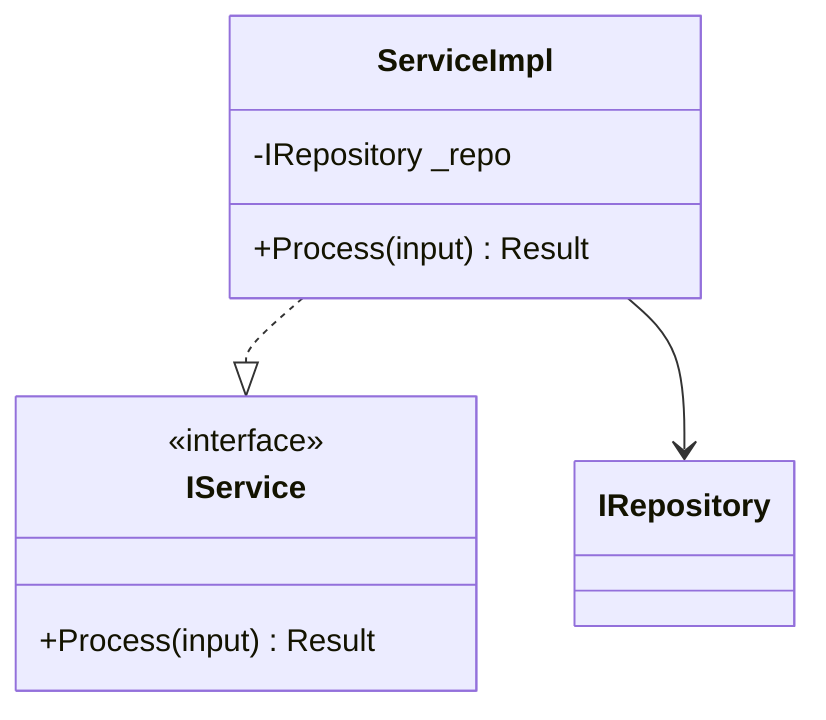
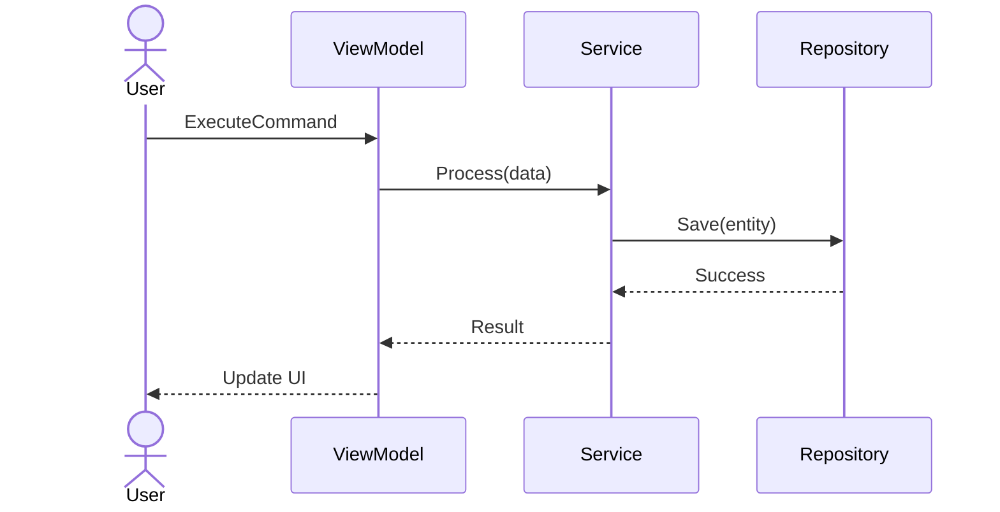
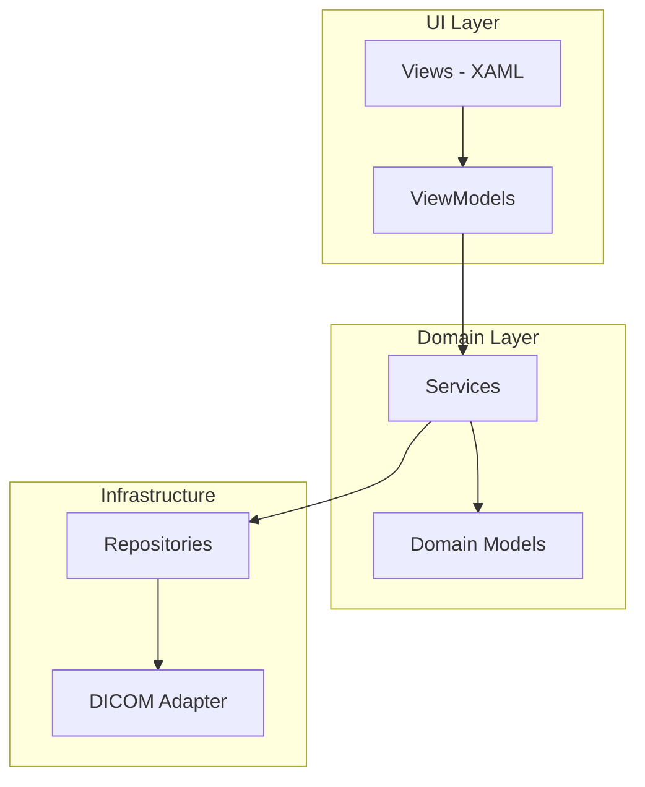
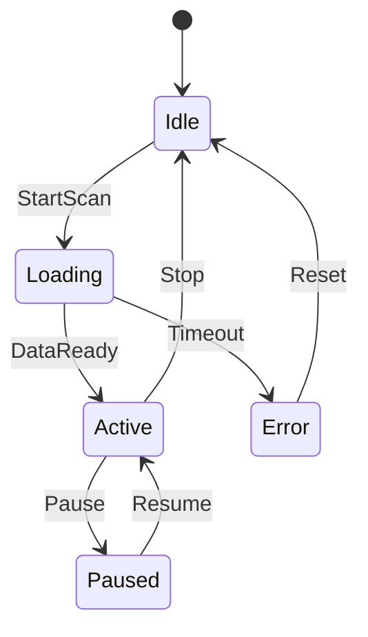

# Architecture Design

Use this skill for architecture-level design tasks: comparing solutions, generating diagrams, writing Architecture Decision Records, analyzing dependencies, and assessing cross-project impact.

## When to Use

- When starting a new module — generate architecture proposal with layering and interfaces.
- When comparing design options — produce structured pros/cons analysis.
- When documenting decisions — generate ADR (Architecture Decision Record).
- When visualizing structure — generate Mermaid class/sequence/component diagrams.
- When assessing change impact — analyze dependency chains across projects.
- When reviewing coupling — detect circular dependencies or layer violations.

## Diagram Selection Decision Tree

Different design questions call for different diagrams. Pick **deliberately** — do not default to a class diagram every time.

| Design question | Use this diagram |
|-----------------|------------------|
| "What classes/interfaces exist and how do they relate?" | **Class diagram** |
| "How do components collaborate during a workflow?" | **Sequence diagram** (one per use case) |
| "What is the high-level system structure / layering?" | **Component diagram** |
| "What states does this object move between?" | **State diagram** |
| "What is the data flow through the pipeline?" | **Flowchart** (`graph LR`) |
| "What is the deployment topology?" | **Deployment diagram** (component diagram with subgraphs per host/process) |

**Per design proposal**: include **one component diagram** (overview) **plus at least one** of {class, sequence, state} depending on what is most informative. Do not include all four — redundant diagrams dilute the message.

## Domain-Anchored Examples

When the design touches CT/DICOM/Spectral/ISP, the diagrams and proposals should reflect **real domain constraints** from `domain-knowledge`, not generic ViewModel/Service shapes. Examples:

- **SBI version compatibility** → show a version-gate component between Reader and Data (one-way compatibility rule)
- **Concurrent spectral results limit** → show a throttler / semaphore in front of the spectral engine (max-4 rule)
- **DICOM read/write boundary** → show DICOM adapter as a dedicated layer; domain types never expose `DicomDataset`
- **Lossy compression guard** → show a transfer-syntax check at the diagnostic-pipeline entry
- **MVVM for medical UI** → ViewModels never call DICOM I/O directly; route through a Service
- **Cross-solution shared DLL** → show the published artifact as an external rectangle, not as a project node

If the skill is asked to draw a diagram for a domain concept, the resulting Mermaid should make the constraint visible — a label on the edge, a `<<gateway>>` stereotype on a node, or a comment.

## Preferred Inputs

Provide one or more of the following:

- **Design question** — e.g., "Should we use Strategy or State pattern for scan mode switching?"
- **Module / component name** — for diagram generation or dependency analysis.
- **Change description** — for cross-project impact assessment.
- **Existing code** — the skill will analyze the current structure.

## Output Types

### 1. Architecture Proposal

Compare solution options with structured analysis:

```markdown
## Architecture Proposal — [Topic]

### Option A: [Name]
- **Approach:** [Description]
- **Pros:** [List]
- **Cons:** [List]
- **Fit for CT:** [IEC 62304 / DICOM / performance considerations]

### Option B: [Name]
- **Approach:** [Description]
- **Pros:** [List]
- **Cons:** [List]
- **Fit for CT:** [considerations]

### Recommendation
Option [X] because [rationale].

### Risk
[What could go wrong with this choice]
```

**Decision is made by the Architect / Tech Lead — AI provides analysis only.**

### 2. Architecture Decision Record (ADR)

```markdown
# ADR-[NNN]: [Decision Title]

- **Status:** Proposed | Accepted | Deprecated | Superseded
- **Date:** [YYYY-MM-DD]
- **Decision Makers:** [Architect, Tech Lead]

## Context
[Why this decision is needed — the problem or requirement]

## Decision
[What we decided to do]

## Rationale
[Why this option was chosen over alternatives]

## Alternatives Considered
1. [Alternative A] — rejected because [reason]
2. [Alternative B] — rejected because [reason]

## Consequences
- **Positive:** [benefits]
- **Negative:** [trade-offs]
- **Risks:** [what could go wrong]

## Compliance
- IEC 62304 class: [A/B/C]
- Impact on existing modules: [list]
- Migration plan: [if applicable]
```

### 3. Mermaid Diagrams

Generate diagrams based on the analysis scope:

**Class Diagram** — for module structure:


**Sequence Diagram** — for workflow / interaction:


**Component Diagram** — for system overview:


**State Diagram** — for stateful components:


### 4. Dependency Analysis

Analyze coupling between modules:

```markdown
## Dependency Analysis — [Module]

### Direct Dependencies (this module depends on)
| Dependency | Type | Coupling | Risk |
|-----------|------|----------|------|
| ModuleA   | NuGet | Loose   | Low  |
| ModuleB   | Project ref | Tight | Medium |

### Reverse Dependencies (modules that depend on this)
| Consumer | Via | Impact if Changed |
|----------|-----|-------------------|
| ProjectX | Interface | Low (abstracted) |
| ProjectY | Direct class ref | High (breaking) |

### Circular Dependencies
- ⚠ ModuleA → ModuleB → ModuleA (via EventBus)
- Suggestion: Extract shared interface to Common module

### Layer Violations
- ⚠ ViewModel directly references Repository (skip Service layer)
- Suggestion: Inject via IService interface
```

### 5. Cross-Project Impact Assessment

For changes affecting shared components (PPTCommon, CT_SW_Common):

```markdown
## Cross-Project Impact — [Change Description]

### Changed Component
[Component name, API changes, behavioral changes]

### Affected Projects
| Project | Impact | Action Required | Owner |
|---------|--------|----------------|-------|
| MIA_Dev | API signature change | Update call sites | [Name] |
| MIC_Dev | No direct use | None | — |
| Astra   | New project, uses new API | Already compatible | [Name] |

### Migration Plan
1. [Step 1]
2. [Step 2]

### Approval Required
- [ ] Tech Lead
- [ ] Affected project Owners
- [ ] Safety Owner (if Class B/C)
```

## Architecture Principles (CT SW Department)

These principles are enforced in all architecture recommendations:

1. **Clean Architecture** — Dependencies point inward. Domain has no external dependencies.
2. **MVVM for WPF** — View → ViewModel → Service → Repository. No code-behind logic.
3. **Dependency Injection** — Constructor injection via Autofac / built-in DI.
4. **Interface Segregation** — Small, focused interfaces. No "god interfaces".
5. **Single Responsibility** — Each class has one reason to change.
6. **No circular dependencies** — Use interfaces or events to break cycles.
7. **Shared components via NuGet** — PPTCommon, CT_SW_Common published as packages.
8. **DICOM isolation** — DICOM protocol details wrapped behind abstraction layer.
9. **Failure isolation must filter CLR-fatal exceptions** — any architectural `try/catch` boundary that exists to *isolate* a non-essential subsystem from the host (startup loggers, telemetry emitters, optional diagnostics) must catch with the exact filter:
   ```csharp
   catch (Exception ex) when (!(ex is OutOfMemoryException)
                            && !(ex is StackOverflowException)
                            && !(ex is ThreadAbortException))
   ```
   Naked `catch (Exception)` (or `catch` / `catch (Exception ex)` without `when`) at an isolation boundary is an architecture violation even when the prose says "let CLR-fatal propagate" — the prose is not executable. The architecture proposal MUST write the filtered form explicitly in any code sample, ADR, or interface contract that mentions isolation. Inner fallback `catch` blocks (e.g., when the warning-write itself can fail) must use the same filter.

See [architecture-principles.md](./references/architecture-principles.md) for detailed rules.

## Quality Rules

1. **AI proposals are drafts** — Architect / Tech Lead makes the final decision.
2. **Diagrams must be verifiable** — Mermaid syntax must render correctly.
3. **ADRs must be versioned** — committed to repo under `docs/adr/`.
4. **Impact assessments must name owners** — every affected project needs a responsible person.
5. **No gold-plating** — recommend the simplest solution that meets requirements.
6. **Pick diagrams deliberately** — use the [Diagram Selection Decision Tree](#diagram-selection-decision-tree); do not include all four diagram types by default.
7. **Anchor to domain when relevant** — if the design touches DICOM/Spectral/ISP, the diagram must make the domain constraint visible (see [Domain-Anchored Examples](#domain-anchored-examples)).

## Portability Note

This skill is designed to be **team-portable**. The proposal/ADR templates, the 4 Mermaid diagram patterns, the 8 CT architecture principles, and the cross-project impact format are generic and apply to any layered .NET application. Team-specific principles (DI container choice, naming conventions, shared-package layout) belong in `references/architecture-principles.md`, which each team customizes. The `domain-knowledge` cross-references in [Domain-Anchored Examples](#domain-anchored-examples) automatically resolve to whichever team's domain skill is installed.
