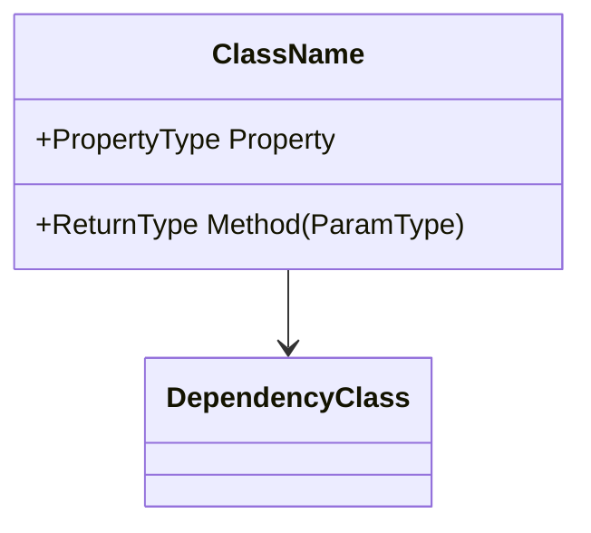
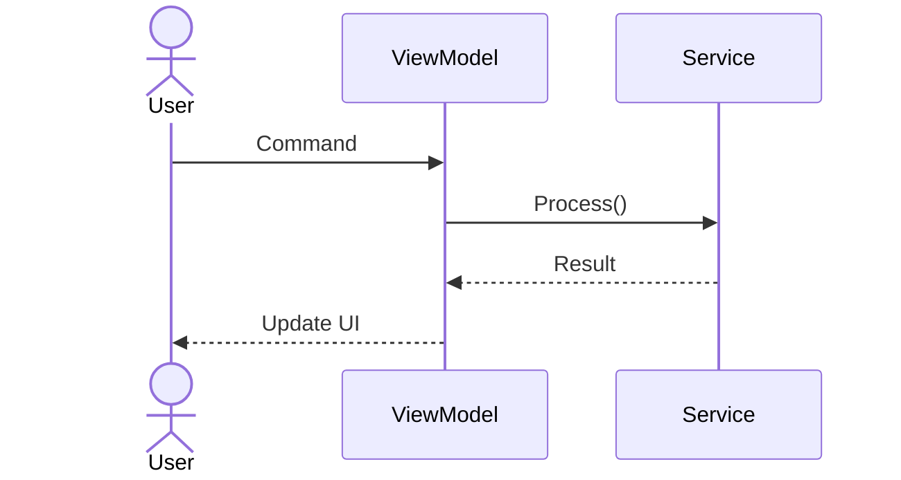
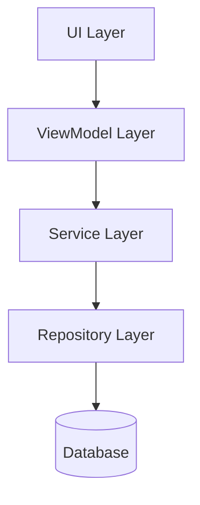

# Documentation Generator

Use this skill to generate structured documentation artifacts for CT software department projects, aligned with IEC 62304 and ISO 13485 requirements.

## When to Use

- After implementing a feature — generate SDS sections, API docs.
- During architecture design — generate UML/Mermaid diagrams.
- Before a release — generate Release Notes from git history.
- During change assessment — generate DFMEA draft or Impact Analysis.
- For training / knowledge sharing — generate structured materials.

## Related Skill: domain-knowledge

All generated documents must use correct CT terminology. Before writing, consult `domain-knowledge`:

- **ct-glossary.md** — formal feature names ("Precise Image" not "AI Recon"), correct units and abbreviations
- **clinical-workflow.md** — standard scanner / ISP workflow vocabulary
- **dicom-patterns.md** — correct tag references in API docs and interface descriptions
- **safety-rules.md** — standard safety-warning text for SDS section 7 (Safety Considerations) and DFMEA/Impact-Analysis safety sections
- **spectral-knowledge.md** — result type units, constraints, and version gates for Spectral CT documentation

For Class B/C documents, also reference `dfmea-analysis` and `ifu-generator` skills for the corresponding draft sections.

## Preferred Inputs

Provide:

- **Document type** — one of: `SDS`, `API`, `architecture`, `release-notes`, `DFMEA`, `impact-analysis`, `training`.
- **Scope** — module name, class name, feature name, or git range (for release notes).
- **Safety class** — A/B/C (affects documentation depth).
- **Existing code / design** — for context.

## Document Types

### 1. Software Design Specification (SDS)

Generate IEC 62304 compliant design documentation:

```markdown
# SDS — [Module Name]

## 1. Purpose
[What this module does and why]

## 2. Scope
[What is included / excluded]

## 3. Architecture Overview
[Mermaid class diagram or component diagram]

## 4. Interface Description
[Public API, events, data contracts]

## 5. Data Design
[Data structures, state management, persistence]

## 6. Behavioral Design
[Sequence diagrams for key workflows]

## 7. Safety Considerations
[IEC 62304 class, risk mitigations, safety-critical paths]

## 8. Dependencies
[External libraries, other modules, hardware interfaces]

## 9. Traceability
[Requirement ID → Design element → Test case mapping]
```

### 2. API Documentation

Generate XML doc comments and Markdown API reference:

```csharp
/// <summary>
/// [Method purpose — one sentence]
/// </summary>
/// <param name="paramName">[Parameter description]</param>
/// <returns>[Return value description]</returns>
/// <exception cref="ArgumentNullException">
/// Thrown when <paramref name="paramName"/> is null.
/// </exception>
/// <example>
/// <code>
/// var result = instance.MethodName(input);
/// </code>
/// </example>
```

For Markdown output:
```markdown
### `MethodName(Type paramName) → ReturnType`

**Purpose:** [description]

**Parameters:**
| Name | Type | Description | Required |
|------|------|-------------|----------|
| paramName | Type | description | Yes |

**Returns:** ReturnType — [description]

**Exceptions:**
- `ArgumentNullException` — when paramName is null.

**Example:**
[code example]
```

### 3. Architecture Diagrams (Mermaid)

Generate diagrams based on the requested type:

**Class Diagram:**


**Sequence Diagram:**


**Component Diagram:**


### 4. Release Notes

Generate from git history:

```markdown
# Release Notes — v[X.Y.Z] — [Date]

## New Features
- **[Feature Name]**: [Description] ([Story ID])

## Bug Fixes
- **[Fix Title]**: [Root cause and fix description] ([Bug ID])

## Improvements
- **[Improvement]**: [Description]

## Breaking Changes
- **[Change]**: [Migration guide]

## Known Issues
- **[Issue]**: [Workaround if available]

## Test Summary
- Unit Tests: [X passed / Y total]
- BDD Scenarios: [X passed / Y total]
- TICS Level: [Level]
```

### 5. DFMEA Draft

Generate a draft Design Failure Mode and Effects Analysis:

```markdown
## DFMEA — [Change Description]

| # | Failure Mode | Effect | S | Cause | O | Detection | D | RPN | Mitigation |
|---|-------------|--------|---|-------|---|-----------|---|-----|------------|
| 1 | [mode]      | [effect]| ? | [cause]| ? | [method]  | ? | ?   | [action]   |

⚠ S/O/D scores are AI suggestions only.
Final RPN must be confirmed by Safety Owner.
```

Severity (S), Occurrence (O), Detection (D): 1-10 scale.

### 6. Impact Analysis

Generate a structured change impact assessment:

```markdown
## Impact Analysis — [Change Description]

### Direct Impact
- [Files/modules directly modified]

### Indirect Impact
- [Dependent modules affected via API/interface changes]

### Test Impact
- [Test cases that need re-execution]
- [New tests needed]

### Configuration Impact
- [Config files, environment variables, database changes]

### Deployment Impact
- [Deployment steps, rollback plan]

### Safety Impact (IEC 62304)
- Safety class: [A/B/C]
- Patient safety risk: [Yes/No — describe if Yes]
- Regulatory impact: [None / Notification / Submission]

### Approval Requirements
- [ ] Code Review: [Reviewer]
- [ ] Tech Lead: [Name]
- [ ] Safety Owner: [Name] (if Class B/C)
- [ ] DFMEA update: [Required / Not Required]
```

## Quality Rules

1. **AI documentation is DRAFT only** — every output must be reviewed by the designated confirmer.
2. **No fabricated content** — if information is unknown, mark it as `[TBD — confirm with stakeholder]`.
3. **Mermaid diagrams must be syntactically valid** — verify rendering before committing.
4. **Traceability** — every SDS section should reference the source requirement.
5. **Safety class determines depth** — Class C requires the most detailed documentation.

## Confirmer Matrix

| Document Type | Confirmer | Approval |
|--------------|-----------|----------|
| SDS | Architect + SE | Tech Lead sign-off |
| API Documentation | Developer | Peer review |
| Architecture Diagram | Architect | Tech Lead |
| Release Notes | PM | PM sign-off |
| DFMEA | Safety Owner | Safety Owner sign-off |
| Impact Analysis | Tech Lead | Tech Lead + affected Owner |
| Training Material | Instructor | Peer review |

## Portability Note

This skill is **team-portable**. The document type templates (SDS / API / architecture / release-notes / DFMEA / impact-analysis), Mermaid patterns, and confirmer matrix follow IEC 62304 / ISO 13485 and apply to any medical-device codebase. Terminology and safety-warning text come from the separate `domain-knowledge` skill — another team's domain skill supplies different content automatically. Team-specific document conventions (header logos, document-ID schemes, internal review roles) belong in `references/` files or `/memories/repo/`, not hardcoded here.
