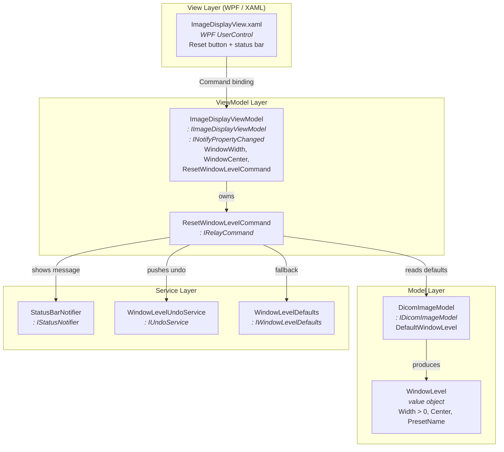
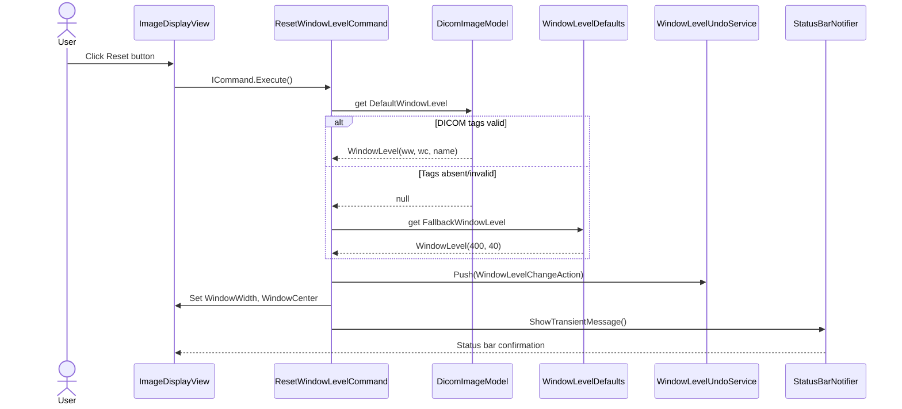

# Sub-System Design Specification

## PURPOSE

<!-- GUIDANCE: The purpose of this document is to provide the <System or Sub-System Design Specification> for the product <Product Name>. -->

The purpose of this document is to provide the Sub-System Design Specification (SSDS) for the **Image Display** sub-system of the Philips CT/AMI product. This sub-system is responsible for rendering CT image slices in the diagnostic viewport and providing display-parameter controls (Window Width / Window Center adjustment, zoom, pan, and reset-to-default) to the clinical operator.

## SCOPE

<!-- GUIDANCE: This record applies to the Philips CT/AMI. -->
<!-- GUIDANCE: [Provide description of the scope of the design document to detail the boundaries of the design as described by this document] -->

This record applies to the Philips CT/AMI Image Display sub-system. The scope of this design document covers:

- The WW/WC Reset to Default feature (FR-01 through FR-07, NFR-01 through NFR-05 per SwRS)
- The MVVM layered architecture for the Image Display module
- Interface contracts defined in `ExtInf/ImageDisplay/`
- Implementation components in `Src/ImageDisplay/`
- Undo infrastructure for display-parameter changes
- DICOM tag access abstraction for windowing attributes

Out of scope: DICOM dataset loading/parsing infrastructure, image rendering engine internals, multi-viewport synchronisation, and non-CT modality support.

## ARCHITECTURE DESIGN OBJECTIVES

<!-- GUIDANCE: [Author: Lead Designer or Design Authority] -->
<!-- GUIDANCE: [For the sake of consistency throughout the system, it is best for the Lead Designer to author this section. However, for the sake of time constraint and distribution of work, it may be more practical for the Design Authority to complete some or all of the subsections after the Overview subsection. In this case, the Lead Designer should be one of the reviewers.] -->

### Overview

<!-- GUIDANCE: [A short history, background, and use of the system or Sub-System will be presented here. Include a description of how the system or Sub-System fits in the product and, as applicable, a reference to the parent PRS or SDS.] -->

The Image Display sub-system is the primary clinical interface for viewing CT image slices. It renders DICOM image data in a viewport and provides interactive controls for adjusting display parameters — most critically, Window Width (WW) and Window Center (WC), which control the mapping of CT Hounsfield Unit values to the displayed grayscale range.

The WW/WC Reset to Default feature adds a one-click mechanism for restoring the scanner- or protocol-defined default windowing values stored in DICOM tags (0028,1050) Window Center and (0028,1051) Window Width per DICOM PS3.3 §C.7.6.3.1.5. This feature is classified as IEC 62304 Class B because incorrect WW/WC values can mask clinically significant features (e.g., lung nodules, haemorrhage), contributing to missed or delayed diagnosis.

The sub-system follows the WPF Model–View–ViewModel (MVVM) pattern with strict separation of concerns: Views are pure XAML (zero code-behind), ViewModels expose commands and observable properties, and Models encapsulate DICOM data access.

### Assumptions and Constraints

<!-- GUIDANCE: [Any assumptions constraints used in creation of this document are to be listed here. This can include any impact across product lines, existing components that are imposed to be “re-used” and not re-developed, etc.] -->
**Assumptions:**

1. The application is a WPF desktop client targeting .NET (version TBD) with MVVM architecture.
2. No existing `Src/` tree or undo infrastructure exists — this is a greenfield implementation (ADR-001).
3. The DICOM dataset is already loaded and accessible to the model layer when the reset action is invoked; this feature does not handle dataset loading.
4. The deployment target is a secondary review workstation (IEC 62304 Class B). If primary diagnostic workstation deployment is confirmed (OQ-01), Class C lifecycle activities will be required but the architecture does not change.

**Constraints:**

1. WPF/MVVM architecture — zero code-behind in Views; all logic via ViewModel command bindings.
2. Namespace: `Philips.CT.Host.ImageDisplay.*` — never the VS default namespace.
3. All UI strings sourced from `.resx` resource files — no hardcoded strings.
4. WW > 0 invariant enforced at the value-object level — the system must never allow WW ≤ 0 to reach the display pipeline.
5. DICOM tag access through a centralised constants class with XML doc comments referencing DICOM PS3.3 §C.7.6.3.1.5.
6. Zero build warnings; warnings treated as errors.
7. Constructor injection for all ViewModel dependencies — no service locator pattern.
## SYSTEM ARCHITECTURE

### Design Overview

<!-- GUIDANCE: [This section describes the top-level design of the system including the theory of operation and the system decomposition. Each of the sub-systems is presented and the relationships between them. The interactions and behaviors are handled later. Add other subheadings as needed.] -->
<!-- GUIDANCE: The design overview describes the big picture to help with understanding the details that will follow. A diagram\s is\are used here to help explain the overall system design and relation between the sub-systems. If the project team determines that Sub-System Design Specification documents are warranted or not warranted to properly document the system architecture, that decision is to be stated in this section with appropriate rationale.] -->

The Image Display sub-system is decomposed into four layers following the MVVM pattern with an additional Service layer for cross-cutting concerns:

1. **View Layer** — WPF UserControls (XAML) that render the image viewport, display-parameter controls, and status bar. Zero code-behind; all interaction via data binding.
2. **ViewModel Layer** — Exposes observable properties (`WindowWidth`, `WindowCenter`, `IsSeriesLoaded`, `StatusMessage`) and commands (`ResetWindowLevelCommand`, `UndoCommand`). Mediates between View and Model/Service layers.
3. **Model Layer** — Encapsulates DICOM image data. `DicomImageModel` parses windowing attributes from the loaded series and exposes validated `WindowLevel` value objects.
4. **Service Layer** — Provides cross-cutting capabilities: status notification (`IStatusNotifier`), undo management (`IUndoService`), and fallback configuration (`IWindowLevelDefaults`).

Interface contracts for all layers are defined in `ExtInf/ImageDisplay/`, ensuring that implementations can be substituted for testing (NSubstitute mocks) and that cross-repository dependencies reference only the interface package.

This decomposition is documented in a single SSDS; separate sub-system design documents are not warranted given the bounded scope of the Image Display module.

### Primary Design Considerations

<!-- GUIDANCE: [Explain any issues of a general nature that need to be understood related to the design. This can include such issues as those related to manufacturing design considerations, service design considerations, cost, reliability, usability etc.] -->
<!-- GUIDANCE: [If applicable, in the case of new technologies to be implemented for the first time in this System or Sub-System design: reference the corresponding Proof of Concept Report(s) for verification that the technology to be employed is within the organization’s competency. This may be discussed under a subsequent “issue” heading as appropriate.] -->
<!-- GUIDANCE: [Add additional issues below, as needed.] -->

#### Patient Safety — WW > 0 Invariant

Window Width (WW) values of zero or negative are undefined in the DICOM standard and produce black or inverted images, which can mask all diagnostic content. The design enforces WW > 0 structurally through a `WindowLevel` value object that rejects invalid values at construction time. This guard applies uniformly to values from DICOM tags, fallback configuration, and the undo stack.

#### Usability — Sub-200 ms Response Time

Clinical workflow is time-sensitive. The reset action must complete (button activation → viewport repaint → confirmation message) within 200 ms on minimum-specification hardware (NFR-01). The design achieves this by reading pre-parsed DICOM attributes from the in-memory model (no file I/O on the reset path) and updating only two ViewModel properties that trigger WPF binding refresh.

#### Reliability — Graceful Degradation

The design must handle all DICOM dataset variants without crashing (NFR-04): missing tags, corrupt values, multi-frame series, and empty series. The reset command wraps its logic in a try/catch that logs warnings, leaves the current WW/WC unchanged, and notifies the user via the status bar.

#### DICOM Standard Traceability

All DICOM tag access is centralised in a `DicomDisplayTags` static class with XML doc comments referencing DICOM PS3.3 §C.7.6.3.1.5. No magic-number tag literals appear outside this class (NFR-05).

### Design Features

<!-- GUIDANCE: [Description:] -->
<!-- GUIDANCE: [Describe the dynamic model, workflows, or specifically how the Sub-Systems or components work together to achieve the required features. Natural language, graphical models, and use cases can be used, as appropriate. Design features normally focus on Clinical use, but a new product may include other new design feature e.g. License Keys, Remote Service etc…] -->

#### WW/WC Reset to Default

The WW/WC Reset feature restores DICOM-default Window Width and Window Center values for the active viewport with a single user action. The workflow is:

1. **User activates reset** — clicks the "Reset Window/Level" button or presses Ctrl+Shift+W.
2. **View fires bound command** — WPF invokes `ResetWindowLevelCommand.Execute()` via `ICommand` binding.
3. **Command captures undo state** — current `WindowWidth` and `WindowCenter` are snapshot into a `WindowLevelChangeAction`.
4. **Command retrieves defaults** — reads `IDicomImageModel.DefaultWindowLevel` (DICOM tags 0028,1050/1051, first value at index 0). If absent or invalid (WW ≤ 0), falls back to `IWindowLevelDefaults.FallbackWindowLevel` (configurable, default WW=400, WC=40).
5. **Command validates** — creates a `WindowLevel` value object via `WindowLevel.Create()`, which enforces WW > 0.
6. **Command applies values** — sets `ImageDisplayViewModel.WindowWidth` and `.WindowCenter`. `INotifyPropertyChanged` fires, WPF binding propagates to the View, and the image re-renders.
7. **Command pushes undo** — the `WindowLevelChangeAction` is pushed onto the `IUndoService` stack.
8. **Command shows confirmation** — calls `IStatusNotifier.ShowTransientMessage()` with a formatted message including preset name (from tag 0028,1055 if available). The message auto-dismisses after ≥ 2 seconds.

The following sequence diagram illustrates this flow:

**Design patterns chosen (ADR-001):**

- **RelayCommand** (`IRelayCommand`) for MVVM command binding — lightweight, no framework dependency.
- **Value Object** (`WindowLevel`) for WW/WC pair — enforces WW > 0 invariant at construction.
- **Command pattern** (`IUndoableAction`) for undo/redo — each undoable operation is encapsulated in an action object.
- **Strategy pattern** for status notification — `IStatusNotifier` abstracts the feedback mechanism, allowing the ViewModel to remain UI-framework-agnostic.

### Hardware Design

*Not Applicable — the Image Display sub-system is a pure software component with no hardware elements. It renders images on standard display hardware managed by the operating system and graphics driver.*

### Software Design

The Image Display sub-system follows a layered MVVM architecture with constructor-injected dependencies. All interface contracts reside in `ExtInf/ImageDisplay/` (namespace `Philips.CT.Host.ImageDisplay`); all implementations reside in `Src/ImageDisplay/` with sub-namespaces for Commands, Models, Services, Constants, Views, and Resources.

#### Image Display ViewModel Module

`ImageDisplayViewModel` (implementing `IImageDisplayViewModel` and `INotifyPropertyChanged`) is the central coordinator. It exposes:

- **Properties:** `WindowWidth` (double), `WindowCenter` (double), `IsSeriesLoaded` (bool), `StatusMessage` (string) — all observable via `PropertyChanged`.
- **Commands:** `ResetWindowLevelCommand` (`IRelayCommand`), `UndoCommand` (`IRelayCommand`).
- **Constructor dependencies:** `IDicomImageModel`, `IStatusNotifier`, `IUndoService`, `IWindowLevelDefaults`.

The ViewModel never accesses DICOM tags directly — it delegates to the model for default values and to services for fallback, undo, and notification.

#### Reset Command Module

`ResetWindowLevelCommand` (implementing `IRelayCommand`) encapsulates the reset logic:

- `CanExecute` returns `true` only when `IsSeriesLoaded` is `true`.
- `Execute` reads defaults from the model (index 0 of multi-valued DICOM tags), validates WW > 0, applies fallback if needed, captures undo state, updates ViewModel properties, and fires the status notification.
- All exceptions are caught, logged at WARNING level, and surfaced to the user via `IStatusNotifier`. The current WW/WC is left unchanged on error.

#### DICOM Image Model Module

`DicomImageModel` (implementing `IDicomImageModel`) parses DICOM windowing attributes from the loaded series dataset:

- **Inputs:** DICOM tags (0028,1050) Window Center, (0028,1051) Window Width, (0028,1055) Window Center & Width Explanation — accessed via `DicomDisplayTags` constants.
- **Outputs:** `DefaultWindowLevel` (nullable `WindowLevel` value object) containing the first preset (index 0) and optional preset name.
- **Limits/defaults:** If tags are absent, `DefaultWindowLevel` is `null`. If WW ≤ 0, `HasValidDefaultWindowLevel` is `false`.

#### WindowLevel Value Object

`WindowLevel` is a record/struct shared between `ExtInf/` and `Src/`. It enforces the domain invariant:

- `Width` must be > 0 (enforced by `WindowLevel.Create()` factory method; throws `ArgumentOutOfRangeException` on violation).
- `Center` is any finite double.
- `PresetName` is optional (nullable string from tag 0028,1055).

#### Undo Module

`WindowLevelUndoService` (implementing `IUndoService`) maintains a bounded stack (default depth: 20 entries, configurable) of `IUndoableAction` objects. `WindowLevelChangeAction` captures the pre-reset and post-reset WW/WC values; `Undo()` restores the pre-reset values by setting the ViewModel properties.

#### Fallback Configuration Module

`WindowLevelDefaults` (implementing `IWindowLevelDefaults`) reads the fallback WW/WC pair from application settings (default: WW = 400, WC = 40). Values are validated at load time (WW > 0). Configuration is changeable without a software rebuild (FR-04).

#### Status Notification Module

`StatusBarNotifier` (implementing `IStatusNotifier`) sets a bound `StatusMessage` property on the ViewModel and starts a `DispatcherTimer` for auto-dismiss (minimum duration: 2 seconds per FR-05). The message includes the preset name when available (e.g., "Window/Level reset to 'Soft Tissue' (WW 400 / WC 40)").

#### DICOM Constants Module

`DicomDisplayTags` is a static class centralising DICOM tag identifiers:

| Constant | Tag | DICOM Reference |
|----------|-----|----------------|
| `WindowCenter` | (0028,1050) | PS3.3 §C.7.6.3.1.5 |
| `WindowWidth` | (0028,1051) | PS3.3 §C.7.6.3.1.5 |
| `WindowCenterWidthExplanation` | (0028,1055) | PS3.3 §C.7.6.3.1.5 |

Each constant carries an XML doc comment referencing the standard section (NFR-05).

#### System and Sub-System Software Risk Classification

<!-- GUIDANCE: [SW Classification is shown at the System level with an abstract classification diagram of the Sub-systems to show the classification hierarchy from System down to Sub-system] -->
<!-- GUIDANCE: [Software shall be classified per the Risk Management SOP (2003000438). SW Classification shall be discussed at the System Level (SDS) and/or at the Sub-System Level (SSDS and SwDS) depending on the complexity and the decomposition approach chosen. Software Classification shall be shown in the product Risk Management Matrix in the line item associated with the Software Module. The classification of the software module will be used as part of the design process.] -->
<!-- GUIDANCE: Software Module Classification Table: -->
<!-- GUIDANCE: * This Software Module table is used to describe the system design. This table does not perform the software classification; it only uses the information to further describe design decisions. -->

| Software Module | Software Module Description | Safety Classification (B or C only) |
| --- | --- | --- |
| ImageDisplayViewModel | Central ViewModel coordinating display-parameter commands, WW/WC state, and user notifications. Part of the diagnostic image display pipeline. | B |
| ResetWindowLevelCommand | Command that restores DICOM-default WW/WC values. Directly affects diagnostic image rendering. | B |
| DicomImageModel | Model that parses and exposes DICOM windowing attributes from the loaded series. Supplies values to the display pipeline. | B |
| WindowLevel | Value object enforcing WW > 0 invariant. Safety guard against black/inverted images. | B |
| WindowLevelUndoService | Undo/redo stack for display-parameter changes. Restores previous WW/WC values. | B |
| WindowLevelDefaults | Configuration service providing fallback WW/WC when DICOM defaults are absent. | B |
| StatusBarNotifier | Non-blocking UI notification service. Does not affect image rendering. | B |
| DicomDisplayTags | Static constants for DICOM tag identifiers. No runtime behaviour. | B |

#### Sub-System Software Risk Classification Segregation Rationale

<!-- GUIDANCE: [SW segregation rationale provided here for SW Items that are A and B] -->

All modules in the Image Display sub-system are classified as **Class B**. The sub-system is segregated from the acquisition and reconstruction pipelines (which carry independent safety classifications) through well-defined interface boundaries: the Image Display sub-system receives DICOM data as a read-only input and does not modify, store, or transmit patient data. The `WindowLevel` value object provides an additional safety barrier by structurally preventing WW ≤ 0 values from reaching the display pipeline, regardless of the data source (DICOM tags, fallback configuration, or undo stack).

If OQ-01 is resolved as primary diagnostic workstation deployment, the classification may be elevated to Class C, which would require additional FMEA and formal verification activities but would not change the architectural decomposition.
<!-- GUIDANCE: [Example provided from this line until the end of this section] -->
<!-- GUIDANCE: <The software ARCHITECTURE should promote segregation of software items that are required for safe operation and should describe the methods used to ensure effective segregation of those SOFTWARE ITEMS. Segregation is not restricted to physical (processor or memory partition) -->
<!-- GUIDANCE: separation but includes any mechanism that prevents one SOFTWARE ITEM from negatively -->
<!-- GUIDANCE: affecting another. The adequacy of a segregation is determined based on the RISKS involved -->
<!-- GUIDANCE: and the rationale which is required to be documented. -->
<!-- GUIDANCE: The Figure below illustrates the possible partitioning for SOFTWARE ITEMS within a SOFTWARE SYSTEM -->
<!-- GUIDANCE: and how the software safety classes would be applied to the group of SOFTWARE ITEMS in the decomposition. -->
<!-- GUIDANCE: Figure – Example of partitioning of SOFTWARE ITEMS -->
<!-- GUIDANCE: For this example, the MANUFACTURER knows, due to the type of MEDICAL DEVICE SOFTWARE being developed, that the preliminary software safety classification for the SOFTWARE SYSTEM is software safety class C. During software ARCHITECTURE design the MANUFACTURER has decided to partition the SYSTEM, as shown, with 3 SOFTWARE ITEMS – X, W and Z. The MANUFACTURER is able to segregate all SOFTWARE SYSTEM contributions to HAZARDS and HAZARDOUS SITUATIONS which could result in death or SERIOUS INJURY to SOFTWARE ITEM Z and all remaining SOFTWARE SYSTEM contributions to HAZARDS and HAZARDOUS SITUATIONS which could result in a non-SERIOUS INJURY to SOFTWARE ITEM W. SOFTWARE ITEM W is classified as software safety class B and SOFTWARE ITEM Z is at software safety class C. SOFTWARE ITEM Y therefore must be classified as Class C). The SOFTWARE SYSTEM is also at a software safety class C per this requirement. SOFTWARE ITEM X has been classified at a software safety class of A. The MANUFACTURER is able to document a rationale for the segregation between SOFTWARE ITEMS X and Y, as well as SOFTWARE ITEMS W and Z, to assure the integrity of the segregation. If partitioning segregation is not possible between SOFTWARE ITEMS X and Y, then SOFTWARE ITEM X must be classified in software safety class C.> -->

### Mechanical Design

*Not Applicable — the Image Display sub-system is a pure software component with no mechanical elements.*

### Interfaces

<!-- GUIDANCE: [Sub-Systems (SSDS): Identify the means by which modules interact with each other and with external entities.] -->

The Image Display sub-system defines the following interface contracts in `ExtInf/ImageDisplay/`:

| Interface | Purpose | Key Members |
|-----------|---------|-------------|
| `IImageDisplayViewModel` | ViewModel contract exposed to the View layer | `WindowWidth`, `WindowCenter`, `IsSeriesLoaded`, `ResetWindowLevelCommand` |
| `IDicomImageModel` | Model contract for DICOM windowing data | `DefaultWindowLevel`, `HasValidDefaultWindowLevel` |
| `IStatusNotifier` | Transient non-blocking message delivery | `ShowTransientMessage(string, TimeSpan)` |
| `IUndoService` | Undo/redo stack management | `Push(IUndoableAction)`, `Undo()`, `Redo()`, `CanUndo`, `CanRedo` |
| `IUndoableAction` | Single undoable operation | `Execute()`, `Undo()`, `Description` |
| `IWindowLevelDefaults` | Fallback WW/WC configuration | `FallbackWindowLevel` |

**External interfaces:**

- **DICOM dataset** — the `DicomImageModel` reads windowing attributes from the loaded DICOM series. The dataset is provided by the application's DICOM loading infrastructure (outside this sub-system's scope). The model is read-only with respect to the dataset.
- **Application settings** — `WindowLevelDefaults` reads fallback WW/WC values from the application configuration file (e.g., `appsettings.json`). This is a one-way read at initialisation time.
- **WPF binding engine** — the View layer binds to ViewModel properties and commands via the standard WPF data-binding infrastructure. No custom binding extensions are required.

### Database and Persistent Data Elements

*Not Applicable — the Image Display sub-system does not use databases or persistent data storage. WW/WC display state is transient (in-memory ViewModel properties). Fallback WW/WC values are read from the application configuration file, which is managed by the application infrastructure, not by this sub-system.*

### Error Handling and Reporting

The Image Display sub-system follows a defensive error-handling strategy aligned with NFR-04 (no unhandled exceptions):

1. **Command-level catch:** `ResetWindowLevelCommand.Execute()` wraps its body in a try/catch. Any exception is:
   - Logged at **WARNING** level with the exception message (no PHI per NFR-03).
   - Reported to the user via `IStatusNotifier.ShowTransientMessage()` with a generic error message ("Reset could not be completed").
   - The current WW/WC values are left unchanged — the display is never left in an indeterminate state.

2. **Value-object validation:** `WindowLevel.Create()` throws `ArgumentOutOfRangeException` if WW ≤ 0. This is caught by the command-level catch and triggers the fallback path (FR-07).

3. **Fallback activation:** When DICOM tags are absent or invalid, the system logs a WARNING and applies the configurable fallback WW/WC (FR-04). The confirmation message indicates that a fallback was used.

4. **Configuration validation:** `WindowLevelDefaults` validates fallback WW > 0 at load time. If the configuration is invalid, the service logs an ERROR and uses the hardcoded safe default (WW=400, WC=40) as a last-resort guard.

### Third Party Solutions

<!-- GUIDANCE: [Identify any third party solutions and the design necessary to incorporate those solutions.] -->

The Image Display sub-system uses the following third-party components:

| Component | Purpose | Integration |
|-----------|---------|-------------|
| CommunityToolkit.Mvvm (or equivalent) | Provides `RelayCommand` / `IRelayCommand` implementation | NuGet package; used for MVVM command binding in the ViewModel. If the project prefers a self-contained implementation, a minimal `RelayCommand` can be authored instead. |
| .NET WPF (`PresentationFramework`) | UI framework for Views, data binding, `DispatcherTimer` | Part of the .NET runtime; no additional integration required. |

### Legacy Elements

*Not Applicable — this is a greenfield implementation. No legacy elements are incorporated.*

## FUNCTIONAL AND PERFORMANCE SPECIFICATION

The following functional and performance specifications are derived from the design:

| Specification | Value | Source |
|---------------|-------|--------|
| Reset action end-to-end latency | ≤ 200 ms (95th percentile) | NFR-01 |
| WW valid range | > 0 (no upper bound) | FR-07, DICOM PS3.3 |
| WC valid range | any finite double | DICOM PS3.3 |
| Fallback WW default | 400 (configurable) | FR-04 |
| Fallback WC default | 40 (configurable) | FR-04 |
| Confirmation message display duration | ≥ 2 seconds, auto-dismiss | FR-05 |
| Undo stack depth | 20 entries (configurable) | ADR-001 |
| Multi-valued DICOM preset selection | Index 0 (first preset) | FR-03 |
| Keyboard shortcut | Ctrl+Shift+W (subject to OQ-05) | NFR-02 |

## SAFETY AND REGULATORY

The Image Display sub-system is classified as **IEC 62304 Class B** (see Software Risk Classification table above). The design addresses the following safety considerations:

1. **WW > 0 invariant (R-02 mitigation):** The `WindowLevel` value object enforces WW > 0 at construction time, preventing black or inverted images from reaching the display pipeline. This is the primary safety guard.
2. **Fallback on absent DICOM tags (R-01 mitigation):** Configurable fallback WW/WC values are applied when DICOM windowing attributes are missing, ensuring the image is always displayed with clinically reasonable settings.
3. **No unhandled exceptions (NFR-04):** The reset command catches all exceptions, logs them, and leaves the display in its previous state. The application never crashes due to a reset action.
4. **No PHI in logs (NFR-03):** The reset action accesses only display-parameter tags (WW/WC), not patient-identifying information. Logging is restricted to tag values and error messages.
5. **Traceability (NFR-05):** All DICOM tag access is centralised and documented with standard references for audit purposes.

If the deployment target is confirmed as a primary diagnostic workstation (OQ-01), the classification will be elevated to Class C, requiring FMEA and formal verification activities. The architecture supports this elevation without structural changes.

## FIELD DEPLOYMENT

### Supported Configurations

<!-- GUIDANCE: [As related to the deployment of the product to the field, define the supported configurations, including peripherals, interaction with other systems, network topologies, etc. -->

### Installation

<!-- GUIDANCE: [System/Sub-Systems: As related to the deployment of the product to the field, define the design elements for both hardware and software installation. Include items such as room configurations, environmental considerations, special shipping and packing, documentation, calibration and adjustment, tools and equipment, installation safety, installation time, user documentation, localization, and training, and performance testing and software.] -->

### Upgrades

<!-- GUIDANCE: [System/Sub-Systems: As related to the deployment of the product to the field, define the design elements to allow upgrading the product.] -->

## MANUFACTURING, SERVICE, AND SUPPORT

<!-- GUIDANCE: [System/Sub-Systems: Identify any diagnostics and other tools in this section, including documentation. Testing access points, diagnostics, test fixtures, calibrations, and etc. are to be addressed. Add additional subsections as appropriate.] -->

### System Calibration and Quality Assurance

<!-- GUIDANCE: [Define the test beds, calibrations, test fixtures, software tools etc. needed to optimize the system and maintain its performance during manufacturing, installation and in the field, including serviceability.] -->

### Design for Manufacturing

<!-- GUIDANCE: [SSDS: Most manufactured parts relate to Sub-Systems. SDS: Certain System approaches and highlights may belong for SDS. SDS/SSDS may point to DHF Child Documents with more detailed design specifications.] -->

### Design for Serviceability

#### System/Sub-System Installation and Upgrade

<!-- GUIDANCE: [Define System & Sub-System installation design elements] -->

#### Remote Service and Monitoring

<!-- GUIDANCE: [Define System & Sub-System design elements for remote connectivity elements, monitoring and data mining for remote export] -->

#### Design for Diagnostics and System Configuration

<!-- GUIDANCE: [Cover in this section subjects such as: -->
<!-- GUIDANCE: Diagnostics & Trouble shooting - Define the design elements for Visual Diagnostics and other troubleshooting tools including remote access. -->
<!-- GUIDANCE: System Logs and Log Viewer(s) - Define the design elements for capturing and managing any persistent logs. -->
<!-- GUIDANCE: System Configuration (Service View) - Define the design elements for capturing System Configuration design.] -->

#### System Maintenance tools and Serviceability supported HW and SW design.

<!-- GUIDANCE: [Define the design elements for capturing System Maintenance tools including remote access and O-Level Access. Point to sub-system hardware design specification for serviceability HW design and serviceability SW requirements] -->

## Design Elements – Requirements Specification Traceability

<!-- GUIDANCE: [This chapter is applicable for SSDS only, and shall be included in SDS only if no SSDS documents exist. If it is not applicable for this document, state N/A. -->
<!-- GUIDANCE: For sub-system main elements (main design output parts, e.g. FRUs), define which sub-system requirements (Design Input) this element is designed to meet] -->
<!-- GUIDANCE: Example for DMS sub-system: -->

| Sub-system Element Name | Element Type | Part Number / Unique Id | SSRS Requirements Id(s) |
| --- | --- | --- | --- |
| ImageDisplayViewModel | Software Module | Philips.CT.Host.ImageDisplay.ImageDisplayViewModel | FR-01, FR-02, FR-05, FR-06, NFR-01 |
| ResetWindowLevelCommand | Software Module | Philips.CT.Host.ImageDisplay.Commands.ResetWindowLevelCommand | FR-01, FR-02, FR-03, FR-04, FR-07, NFR-01 |
| DicomImageModel | Software Module | Philips.CT.Host.ImageDisplay.Models.DicomImageModel | FR-02, FR-03, NFR-05 |
| WindowLevel | Software Module | Philips.CT.Host.ImageDisplay.WindowLevel | FR-02, FR-07 |
| WindowLevelUndoService | Software Module | Philips.CT.Host.ImageDisplay.Services.WindowLevelUndoService | FR-06 |
| WindowLevelDefaults | Software Module | Philips.CT.Host.ImageDisplay.Services.WindowLevelDefaults | FR-04 |
| StatusBarNotifier | Software Module | Philips.CT.Host.ImageDisplay.Services.StatusBarNotifier | FR-05, NFR-01 |
| DicomDisplayTags | Software Module | Philips.CT.Host.ImageDisplay.Constants.DicomDisplayTags | NFR-05 |
| ImageDisplayView | Software Module | Philips.CT.Host.ImageDisplay.Views.ImageDisplayView | FR-01, NFR-02 |

## TERMS AND ABBREVIATIONS

| Term / Abbreviation | Description |
| --- | --- |
| WW | Window Width — the range of CT Hounsfield Unit values mapped to the displayed grayscale range. DICOM tag (0028,1051). |
| WC | Window Center — the midpoint of the displayed Hounsfield Unit range. DICOM tag (0028,1050). |
| DICOM | Digital Imaging and Communications in Medicine — the international standard for medical image data exchange. |
| MVVM | Model–View–ViewModel — a software architectural pattern for WPF applications separating UI, presentation logic, and domain logic. |
| WPF | Windows Presentation Foundation — the .NET UI framework used for desktop application rendering. |
| IEC 62304 | International standard for medical device software lifecycle processes. |
| PHI | Protected Health Information — individually identifiable health information subject to HIPAA privacy rules. |
| ADR | Architecture Decision Record — a document capturing a significant architectural decision, its context, and consequences. |
| HU | Hounsfield Unit — the unit of measurement for CT image pixel values representing tissue density. |

## APPENDICES

| Appendix | Title |
| --- | --- |

## REFERENCES

### External References

| Document ID | Document Title |
| --- | --- |

### Internal References

| Document ID | Document Title |
| --- | --- |

## RECORD CHANGE SUMMARY

| Revision | Document Change No. | Document Editor | Description of Change |
| --- | --- | --- | --- |
| 1.0 | — | sw-architect (AI-assisted) | Initial SSDS for Image Display sub-system: WW/WC Reset to Default feature. Populated all sections including software design (MVVM layered architecture, 8 modules), risk classification (Class B), interfaces, error handling, functional/performance specifications, and safety considerations. Based on ADR-001. |

## RECORD APPROVALS

<!-- GUIDANCE: Signatures and dates are captured in PLM Tool as part of the document change order -->

| Signature Reason | Function | Name |
| --- | --- | --- |

<!-- GUIDANCE: APPENDIX <x> – <Title> -->
